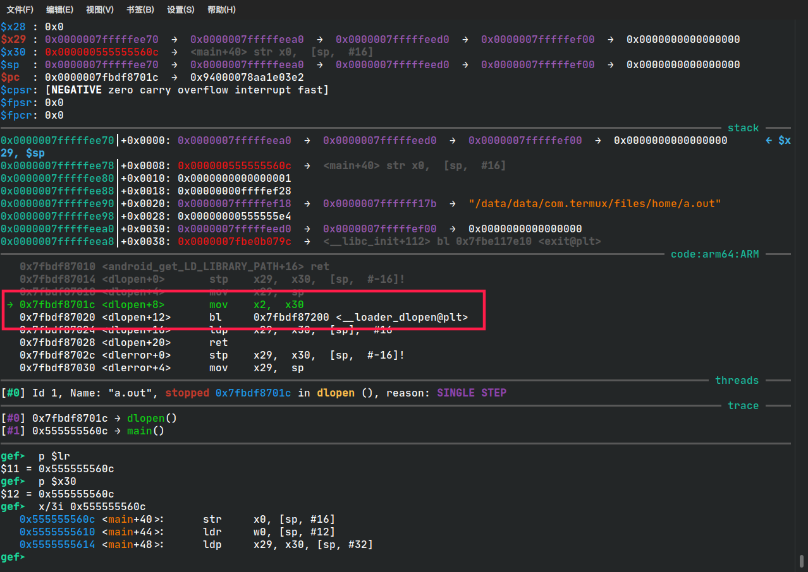
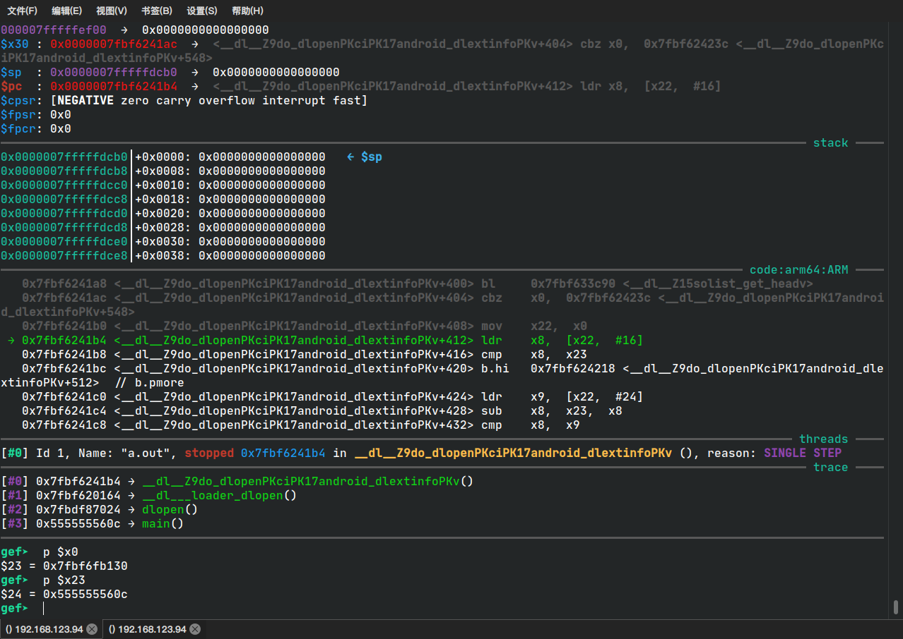

最近有接触到 android 的动态链接

从源码的角度去分析一下 dlopen

android 的 libc 是 bionic

直接开始


dlopen 的入口

libdl/libdl.cpp

```c
__attribute__((__weak__))
void* dlopen(const char* filename, int flag) {
  //这里有用到 gcc 的   内置函数 __builtin_return_address 就是 获取当前函数的返回值
  const void* caller_addr = __builtin_return_address(0);
    //  接着调用了 __loader_dlopen
  return __loader_dlopen(filename, flag, caller_addr);
}
```



 可以看到的是  __loader_dlopen 的第三个参数传的是 x30 寄存器的值，x30 寄存器其实映射了 lr 寄存器的值，也就是返回地址

跟进去

__loader_dlopen

linker/dlfcn.cpp

```c
void* __loader_dlopen(const char* filename, int flags, const void* caller_addr) {
     // 只是把上一个函数的参数传给 dlopen_ext，第三个参数传入的是空指针 nullptr
  return dlopen_ext(filename, flags, nullptr, caller_addr);
}
```

dlopen_ext

```c
static void* dlopen_ext(const char* filename,
                        int flags,
                        const android_dlextinfo* extinfo,
                        const void* caller_addr) {
    // dlopen 函数会持一个全局锁 g_dl_mutex
  ScopedPthreadMutexLocker locker(&g_dl_mutex);
  g_linker_logger.ResetState();
    // 实际工作函数
  void* result = do_dlopen(filename, flags, extinfo, caller_addr);
  if (result == nullptr) {
    __bionic_format_dlerror("dlopen failed", linker_get_error_buffer());
    return nullptr;
  }
  return result;
}
```


do_dlopen

linker/linker.cpp

```c
void* do_dlopen(const char* name, int flags,
                const android_dlextinfo* extinfo,
                const void* caller_addr) {
    // 拼接字符串，当 name 是 nullptr 得到的字符串就是 dlopen: (nullptr), 否则就是 dlopen:  你的链接库的名称
  std::string trace_prefix = std::string("dlopen: ") + (name == nullptr ? "(nullptr)" : name);
    // ScopedTrace 应该是给 trace 工具准备的，使用 trace 工具会得到输出 trace_prefix
  ScopedTrace trace(trace_prefix.c_str());
  ScopedTrace loading_trace((trace_prefix + " - loading and linking").c_str());
    
    // 使用 caller_addr 去找进程的 soinfo
  soinfo* const caller = find_containing_library(caller_addr);
    // 获取命名空间
  android_namespace_t* ns = get_caller_namespace(caller);

  LD_LOG(kLogDlopen,
         "dlopen(name=\"%s\", flags=0x%x, extinfo=%s, caller=\"%s\", caller_ns=%s@%p, targetSdkVersion=%i) ...",
         name,
         flags,
         android_dlextinfo_to_string(extinfo).c_str(),
         caller == nullptr ? "(null)" : caller->get_realpath(),
         ns == nullptr ? "(null)" : ns->get_name(),
         ns,
         get_application_target_sdk_version());

  auto purge_guard = android::base::make_scope_guard([&]() { purge_unused_memory(); });

  auto failure_guard = android::base::make_scope_guard(
      [&]() { LD_LOG(kLogDlopen, "... dlopen failed: %s", linker_get_error_buffer()); });
    
    // 检查给的 flags 是否合法
  if ((flags & ~(RTLD_NOW|RTLD_LAZY|RTLD_LOCAL|RTLD_GLOBAL|RTLD_NODELETE|RTLD_NOLOAD)) != 0) {
    DL_OPEN_ERR("invalid flags to dlopen: %x", flags);
    return nullptr;
  }
    
    // 一般情况下（从 dlopen_ext函数调用过来） extinfo == nullptr
  if (extinfo != nullptr) {
    if ((extinfo->flags & ~(ANDROID_DLEXT_VALID_FLAG_BITS)) != 0) {
      DL_OPEN_ERR("invalid extended flags to android_dlopen_ext: 0x%" PRIx64, extinfo->flags);
      return nullptr;
    }

    if ((extinfo->flags & ANDROID_DLEXT_USE_LIBRARY_FD) == 0 &&
        (extinfo->flags & ANDROID_DLEXT_USE_LIBRARY_FD_OFFSET) != 0) {
      DL_OPEN_ERR("invalid extended flag combination (ANDROID_DLEXT_USE_LIBRARY_FD_OFFSET without "
          "ANDROID_DLEXT_USE_LIBRARY_FD): 0x%" PRIx64, extinfo->flags);
      return nullptr;
    }

    if ((extinfo->flags & ANDROID_DLEXT_USE_NAMESPACE) != 0) {
      if (extinfo->library_namespace == nullptr) {
        DL_OPEN_ERR("ANDROID_DLEXT_USE_NAMESPACE is set but extinfo->library_namespace is null");
        return nullptr;
      }
      ns = extinfo->library_namespace;
    }
  }

  // Workaround for dlopen(/system/lib/<soname>) when .so is in /apex. http://b/121248172
  // The workaround works only when targetSdkVersion < Q.
  std::string name_to_apex;
  if (translateSystemPathToApexPath(name, &name_to_apex)) {
    const char* new_name = name_to_apex.c_str();
    LD_LOG(kLogDlopen, "dlopen considering translation from %s to APEX path %s",
           name,
           new_name);
    // Some APEXs could be optionally disabled. Only translate the path
    // when the old file is absent and the new file exists.
    // TODO(b/124218500): Re-enable it once app compat issue is resolved
    /*
    if (file_exists(name)) {
      LD_LOG(kLogDlopen, "dlopen %s exists, not translating", name);
    } else
    */
    if (!file_exists(new_name)) {
      LD_LOG(kLogDlopen, "dlopen %s does not exist, not translating",
             new_name);
    } else {
      LD_LOG(kLogDlopen, "dlopen translation accepted: using %s", new_name);
      name = new_name;
    }
  }
  // End Workaround for dlopen(/system/lib/<soname>) when .so is in /apex.

  std::string asan_name_holder;

  const char* translated_name = name;
  if (g_is_asan && translated_name != nullptr && translated_name[0] == '/') {
    char original_path[PATH_MAX];
    if (realpath(name, original_path) != nullptr) {
      asan_name_holder = std::string(kAsanLibDirPrefix) + original_path;
      if (file_exists(asan_name_holder.c_str())) {
        soinfo* si = nullptr;
        if (find_loaded_library_by_realpath(ns, original_path, true, &si)) {
          PRINT("linker_asan dlopen NOT translating \"%s\" -> \"%s\": library already loaded", name,
                asan_name_holder.c_str());
        } else {
          PRINT("linker_asan dlopen translating \"%s\" -> \"%s\"", name, translated_name);
          translated_name = asan_name_holder.c_str();
        }
      }
    }
  }

  ProtectedDataGuard guard;
  soinfo* si = find_library(ns, translated_name, flags, extinfo, caller);
  loading_trace.End();

  if (si != nullptr) {
    void* handle = si->to_handle();
    LD_LOG(kLogDlopen,
           "... dlopen calling constructors: realpath=\"%s\", soname=\"%s\", handle=%p",
           si->get_realpath(), si->get_soname(), handle);
    si->call_constructors();
    failure_guard.Disable();
    LD_LOG(kLogDlopen,
           "... dlopen successful: realpath=\"%s\", soname=\"%s\", handle=%p",
           si->get_realpath(), si->get_soname(), handle);
    return handle;
  }

  return nullptr;
}
```


find_containing_library

```c
soinfo* find_containing_library(const void* p) {
  // Addresses within a library may be tagged if they point to globals. Untag
  // them so that the bounds check succeeds.
    // ElfW(Addr)  在 64 位系统展开就是 Elf64_Addr，在 32 位系统展开就是 Elf32_Addr，表示地址类型
    // typedef __u64 Elf64_Addr;  typedef __u32 Elf32_Addr;
  ElfW(Addr) address = reinterpret_cast<ElfW(Addr)>(untag_address(p));
    // 每个进程都有一个 list 去维护进程加载的 动态链接库（so）-- solist 就是这个 list 的 head
    // solist_get_head 得到进程的 solist
  for (soinfo* si = solist_get_head(); si != nullptr; si = si->next) {
      // 如果 address 不是落在 当前 so 文件映射的内存内
      // base 存的是 so 文件加载的基地址
      // address - si->base >= si->size 这个可能有点绕，就是 如果 address 大于 so 文件加载的基地址，如果 address 落在 当前 so 文件映射的内存内，这个条件就不会成立。
      // 可以变换一下，address >= si->base + si->size ，显而易见
    if (address < si->base || address - si->base >= si->size) {
      continue;
    }
      // address 就是 so 中的一个地址，只要减去 load_bias 字段的值就能得到 so 加载的真正的地址
    ElfW(Addr) vaddr = address - si->load_bias;
      // 遍历 Phdr 表，soinfo 的 phnum 存有 Segment 的数量
    for (size_t i = 0; i != si->phnum; ++i) {
      const ElfW(Phdr)* phdr = &si->phdr[i];  
        // 如果 Segment 不可装载
      if (phdr->p_type != PT_LOAD) {
        continue;
      }
        // 如果 vaddr 这个地址落在 phdr 这个 Segment，说明找到了,  返回 soinfo 结构
      if (vaddr >= phdr->p_vaddr && vaddr < phdr->p_vaddr + phdr->p_memsz) {
        return si;
      }
    }
  }
  return nullptr;
}
```



分析之前我得说一下，就是这份源码跟我调试的二进制不是一个版本的，加上编译器的优化问题，可能有一定差异！

solist_get_head 反编译后的：

```asm
   0x7fbf633c90 <__dl__Z15solist_get_headv+0> adrp   x8,  0x7fbf6fb000 <__dl_g_Crc64Table+8168>
   0x7fbf633c94 <__dl__Z15solist_get_headv+4> ldr    x0,  [x8,  #2432]
   0x7fbf633c98 <__dl__Z15solist_get_headv+8> r
```

回来

```asm
   0x0000007fbf6241a8 <+400>:   bl      0x7fbf633c90 <__dl__Z15solist_get_headv>
   0x0000007fbf6241ac <+404>:   cbz     x0, 0x7fbf62423c <__dl__Z9do_dlopenPKciPK17android_dlextinfoPKv+548>
    // x22 就是源码中的 si ，存的是 solist（你可以看到的是 x22 的值来自 x0，x0 存的是 solist_get_head 返回值）
   0x0000007fbf6241b0 <+408>:   mov     x22, x0 
   // base 字段在 soinfo 的偏移量是 16
   0x0000007fbf6241b4 <+412>:   ldr     x8, [x22, #16]
   // 根据源码分析 x23 就是 我们传进来的 dlopen 的返回值
   // address < si->base 
   0x0000007fbf6241b8 <+416>:   cmp     x8, x23
   0x0000007fbf6241bc <+420>:   b.hi    0x7fbf624218 <__dl__Z9do_dlopenPKciPK17android_dlextinfoPKv+512>  // b.pmore
   0x0000007fbf6241c0 <+424>:   ldr     x9, [x22, #24]
   0x0000007fbf6241c4 <+428>:   sub     x8, x23, x8
   // 
   0x0000007fbf6241c8 <+432>:   cmp     x8, x9
   0x0000007fbf6241cc <+436>:   b.cs    0x7fbf624218 <__dl__Z9do_dlopenPKciPK17android_dlextinfoPKv+512>  // b.hs, b.nlast
   0x0000007fbf6241d0 <+440>:   ldr     x8, [x22, #8]
   0x0000007fbf6241d4 <+444>:   cbz     x8, 0x7fbf624218 <__dl__Z9do_dlopenPKciPK17android_dlextinfoPKv+512>
   0x0000007fbf6241d8 <+448>:   ldr     x10, [x22, #256]
   0x0000007fbf6241dc <+452>:   ldr     x9, [x22]
   0x0000007fbf6241e0 <+456>:   sub     x10, x23, x10
   0x0000007fbf6241e4 <+460>:   ldr     w11, [x9]
   0x0000007fbf6241e8 <+464>:   cmp     w11, #0x1
   0x0000007fbf6241ec <+468>:   b.ne    0x7fbf62420c <__dl__Z9do_dlopenPKciPK17android_dlextinfoPKv+500>  // b.any
   0x0000007fbf6241f0 <+472>:   ldr     x11, [x9, #16]
   0x0000007fbf6241f4 <+476>:   cmp     x10, x11
   0x0000007fbf6241f8 <+480>:   b.cc    0x7fbf62420c <__dl__Z9do_dlopenPKciPK17android_dlextinfoPKv+500>  // b.lo, b.ul, b.last
   0x0000007fbf6241fc <+484>:   ldr     x12, [x9, #40]
   0x0000007fbf624200 <+488>:   add     x11, x12, x11
   0x0000007fbf624204 <+492>:   cmp     x10, x11
   0x0000007fbf624208 <+496>:   b.cc    0x7fbf624224 <__dl__Z9do_dlopenPKciPK17android_dlextinfoPKv+524>  // b.lo, b.ul, b.last
   0x0000007fbf62420c <+500>:   subs    x8, x8, #0x1
   0x0000007fbf624210 <+504>:   add     x9, x9, #0x38
   0x0000007fbf624214 <+508>:   b.ne    0x7fbf6241e4 <__dl__Z9do_dlopenPKciPK17android_dlextinfoPKv+460>  // b.any
   // next 在 soinfo 的偏移量是 24
   // si = si->next
   0x0000007fbf624218 <+512>:   ldr     x22, [x22, #40]
   0x0000007fbf62421c <+516>:   cbnz    x22, 0x7fbf6241b4 <__dl__Z9do_dlopenPKciPK17android_dlextinfoPKv+412>

```

