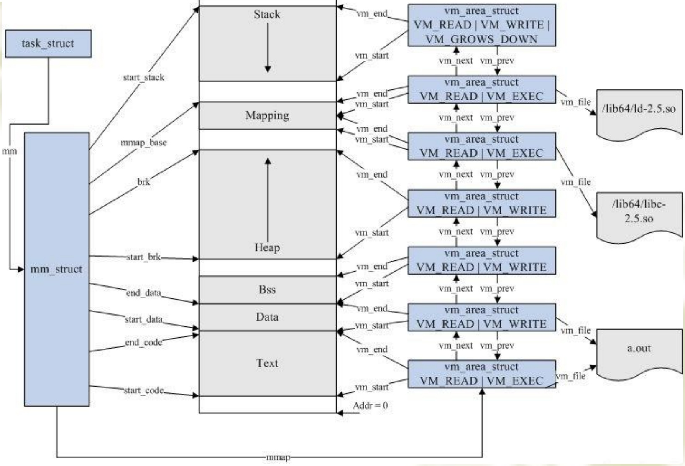

我大概看完了从 glibc 的 malloc 到内核对页的操作原理，现在我从代码的角度去分析它们的工作

malloc 的分析我就不做了，我现在直接从 malloc 对应的系统调用去看，malloc 怎么去操作堆


调用 malloc 是分成两种情况，当 malloc(size)

1. size < 128 Bytes， 会 brk -> sys_brk
2. size >= 128 Byte，会 mmap ->  sys_mmap

当然，查看调用时，glibc 里面的函数调用顺序大概是：

```
__libc_malloc() -> _int_malloc() -> sysmalloc()
```

glibc 中大概的源代码(我已经省去部分无关分析的代码):

/malloc/malloc.c

__libc_malloc:

```c
void *
__libc_malloc (size_t bytes)
{
  mstate ar_ptr;
  void *victim;
.........
.........
.........
  arena_get (ar_ptr, bytes);
.........
.........
.........
  victim = _int_malloc (ar_ptr, bytes);
.........
.........
.........
}
```


_int_malloc:

```c
static void *
_int_malloc (mstate av, size_t bytes)
{
    .........
	.........
	.........
  /*
     Convert request size to internal form by adding SIZE_SZ bytes
     overhead plus possibly more to obtain necessary alignment and/or
     to obtain a size of at least MINSIZE, the smallest allocatable
     size. Also, checked_request2size traps (returning 0) request sizes
     that are so large that they wrap around zero when padded and
     aligned.
   */
  checked_request2size (bytes, nb);

  /* There are no usable arenas.  Fall back to sysmalloc to get a chunk from
     mmap.  */

  if (__glibc_unlikely (av == NULL))
    {
        /*就是这里，这个函数就是分请是使用 mmap 还是 brk*/
      void *p = sysmalloc (nb, av);
      if (p != NULL)
	alloc_perturb (p, bytes);
      return p;
    }
    .........
	.........
	.........
}
```


sysmalloc:


```c
#define DEFAULT_MMAP_THRESHOLD DEFAULT_MMAP_THRESHOLD_MIN
#define DEFAULT_MMAP_THRESHOLD_MIN (128 * 1024)

static struct malloc_par mp_ =
{
  .top_pad = DEFAULT_TOP_PAD,
  .n_mmaps_max = DEFAULT_MMAP_MAX,
  .mmap_threshold = DEFAULT_MMAP_THRESHOLD,
  .trim_threshold = DEFAULT_TRIM_THRESHOLD,
#define NARENAS_FROM_NCORES(n) ((n) * (sizeof (long) == 4 ? 2 : 8))
  .arena_test = NARENAS_FROM_NCORES (1)
};
```


```c
static void *
sysmalloc (INTERNAL_SIZE_T nb, mstate av)
{
  mchunkptr old_top;              /* incoming value of av->top */
  INTERNAL_SIZE_T old_size;       /* its size */
  char *old_end;                  /* its end address */

  long size;                      /* arg to first MORECORE or mmap call */
  char *brk;                      /* return value from MORECORE */

  long correction;                /* arg to 2nd MORECORE call */
  char *snd_brk;                  /* 2nd return val */

  INTERNAL_SIZE_T front_misalign; /* unusable bytes at front of new space */
  INTERNAL_SIZE_T end_misalign;   /* partial page left at end of new space */
  char *aligned_brk;              /* aligned offset into brk */

  mchunkptr p;                    /* the allocated/returned chunk */
  mchunkptr remainder;            /* remainder from allocation */
  unsigned long remainder_size;   /* its size */


  size_t pagesize = GLRO (dl_pagesize);
  bool tried_mmap = false;
 /*
*这里就是判断是不是使用 mmap，可以看到这里有一个名为mp_ 的 malloc_par 结构体
*具体是怎么样的看上面，我已经把主要的宏整理出来
*nb 就是我们要分配的 chunk 的大小
*（是 chunk 的大小不是我们 malloc 的参数 chunk 有metadata，所以 chunk 的大小会大于 malloc 的参数）
*结合上面的我们可以看到 当 chunk 的大小大于 128 * 1024 Bytes 时 就使用 mmap
*/
if (av == NULL
      || ((unsigned long) (nb) >= (unsigned long) (mp_.mmap_threshold)
	  && (mp_.n_mmaps < mp_.n_mmaps_max)))
    {
      char *mm;           /* return value from mmap call*/

    try_mmap:
      /*
         Round up size to nearest page.  For mmapped chunks, the overhead
         is one SIZE_SZ unit larger than for normal chunks, because there
         is no following chunk whose prev_size field could be used.

         See the front_misalign handling below, for glibc there is no
         need for further alignments unless we have have high alignment.
       */
      if (MALLOC_ALIGNMENT == 2 * SIZE_SZ)
        size = ALIGN_UP (nb + SIZE_SZ, pagesize);
      else
        size = ALIGN_UP (nb + SIZE_SZ + MALLOC_ALIGN_MASK, pagesize);
      tried_mmap = true;

      /* Don't try if size wraps around 0 */
      if ((unsigned long) (size) > (unsigned long) (nb))
        {
          mm = (char *) (MMAP (0, size, PROT_READ | PROT_WRITE, 0));
          ................
          ................
      }
```


如果 nb 小于 128 KB，就使用 brk

sysmalloc 有点庞大，基本上就是一些 检查 和 设置标志位，我就不一一详细写，重心放在内核里面


在内核里面对应的是 sys_brk, sys_mmap_pgoff，其实不是很好找

这里就讲一讲怎么在内核里面找被“隐藏”的函数

比如 sys_brk

我用 vscode 选择跳转到工作区中的符号

搜索

sys_brkcc


```c
SYSCALL_DEFINE1(brk, unsigned long, brk)
{
	struct mm_struct *mm = current->mm;

	if (brk < mm->start_brk || brk > mm->context.end_brk)
		return mm->brk;

	if (mm->brk == brk)
		return mm->brk;

	/*
	 * Always allow shrinking brk
	 */
	if (brk <= mm->brk) {
		mm->brk = brk;
		return brk;
	}

	/*
	 * Ok, looks good - let it rip.
	 */
	flush_icache_range(mm->brk, brk);
	return mm->brk = brk;
}
```

这里要讲的就是 mm_struct ，这个结构体是描述进程的内存空间

具体是这样的：



start_brk 指向的是 Heap 起始地址

brk 指向 Heap 的结束地址

其实 brk 操作就是 操作 brk 来调整 Heap 的大小

