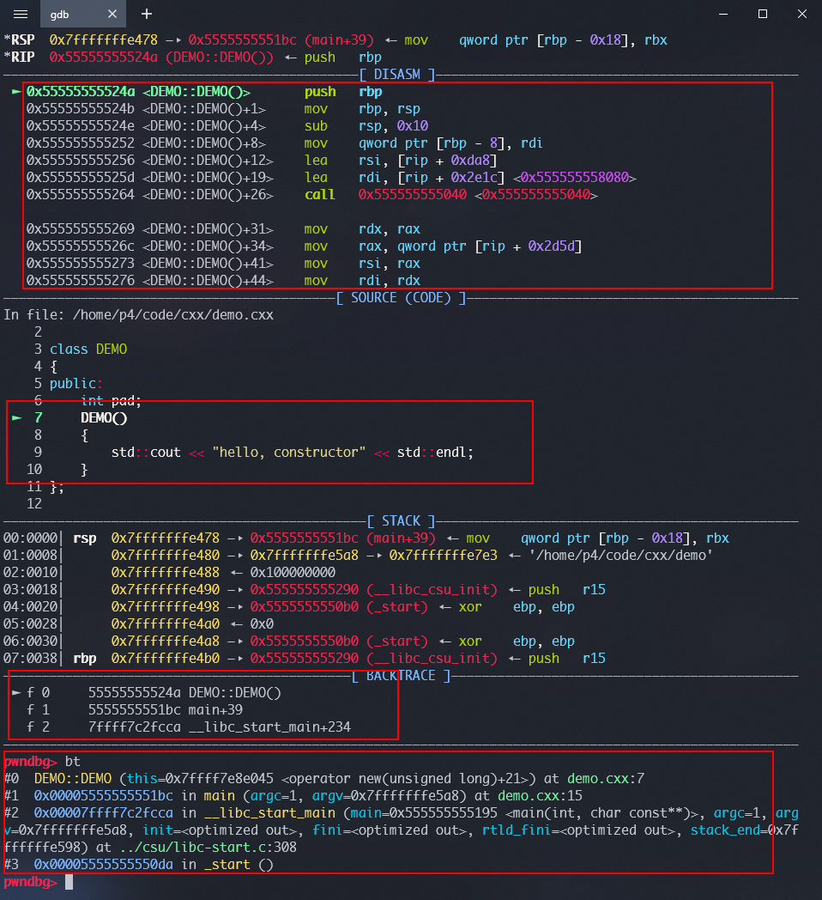

“浅析” 一下 new

## 导语

偶然又有人提起关于 malloc 和 new 的区别，有一点我觉得很奇怪，就是网上总是有人说 new 会调用构造函数，正好这几天一直在写 c++ 逆向题，我总记得我每次看见 c++ 编译出来的程序的汇编 new 和 构造函数是分开调用的

也就是说，**其实不是 new 调用了 构造函数**

## 验证

直接上 demo：

```c++
/*
 g++ -g demo.cxx -o demo
*/
#include <iostream>

class DEMO
{
public:
    int pad;
    DEMO()
    {
        std::cout << "hello, constructor" << std::endl;
    }
};

int main(int argc, const char **argv)
{
    DEMO *demo = new DEMO();
    return 0;
}
```


我用 radare 反汇编的，objdump -d 出来的 函数名需要使用 c++ filt 才能复原函数名（c++ 命名修饰）

```assembly
┌ 59: int main (int argc, char **argv);
│ ; var char **var_30h @ rbp-0x30
│ ; var int64_t var_24h @ rbp-0x24
│ ; var int64_t var_18h @ rbp-0x18
│ ; arg int argc @ rdi
│ ; arg char **argv @ rsi
│ 0x00001195      55             push rbp
│ 0x00001196      4889e5         mov rbp, rsp
│ 0x00001199      4154           push r12
│ 0x0000119b      53             push rbx
│ 0x0000119c      4883ec20       sub rsp, 0x20
│ 0x000011a0      897ddc         mov dword [var_24h], edi              ; argc
│ 0x000011a3      488975d0       mov qword [var_30h], rsi              ; argv
│ 0x000011a7      bf04000000     mov edi, 4
│ 0x000011ac      e89ffeffff     call sym operator new(unsigned long)  ; sym.imp.operator_new_unsigned_long
│ 0x000011b1      4889c3         mov rbx, rax
│ 0x000011b4      4889df         mov rdi, rbx                          ; int64_t arg1
│ 0x000011b7      e88e000000     call method DEMO::DEMO()              ; method.DEMO.DEMO
│ 0x000011bc      48895de8       mov qword [var_18h], rbx
│ 0x000011c0      b800000000     mov eax, 0
└ 0x000011c5      eb1b           jmp loc.000011e2

  ; CODE XREF from main @ 0x11c5
├ 9: loc.000011e2 ();
│ bp: 0 (vars 0, args 0)
│ sp: 0 (vars 0, args 0)
│ rg: 0 (vars 0, args 0)
│ 0x000011e2      4883c420       add rsp, 0x20
│ 0x000011e6      5b             pop rbx
│ 0x000011e7      415c           pop r12
│ 0x000011e9      5d             pop rbp
└ 0x000011ea      c3             ret
```

可以看到 call new 是在 0x000011ac，而 DEMO 类的构造函数是在 0x000011b7  调用的，也就是说其实 new 其实没有调用构造函数，在这里我是在 main 函数里面 new DEMO 的所以还是由 main 函数调用 DEMO 的构造函数

动态调试


```asm
 0x5555555551ac <main+23>    call   0x555555555050 <0x555555555050>
```

就是调用 new 函数，参数就是 DEMO 类的大小（其实类的大小在编译的时候就由编译器计算好了，DEMO 有

一个 int 变量，需要申请 4 字节的内存，所以在调用前要  `mov    edi, 4` ）


new 的汇编代码：

```asm
   0x7ffff7e8e030                                     push   rbx
   0x7ffff7e8e031                                     test   rdi, rdi
   0x7ffff7e8e034                                     mov    ebx, 1
   0x7ffff7e8e039                                     cmovne rbx, rdi
   0x7ffff7e8e03d                                     mov    rdi, rbx
   0x7ffff7e8e040                                     call   malloc@plt <malloc@plt>
   0x7ffff7e8e045                                     test   rax, rax
   0x7ffff7e8e048                                     je     0x7ffff7e8e04c <0x7ffff7e8e04c>
   0x7ffff7e8e04a                                     pop    rbx
   0x7ffff7e8e04b                                     ret
```

可以看到 new 其实就是把 类 的大小传给了  malloc 函数，然后 test 判断 rax 是否是 0 ，rax 就是 malloc 的返回值，一旦 malloc 分配成功 new 直接返回 main 函数（函数的返回值会放在 rax 里面，这里 new 调用了 malloc，malloc 的返回值放在 rax 里面，new 一直到 ret 返回都没有修改过 rax，也就是说 new 返回值其实就是 malloc 的返回值（我说的是 malloc 成功的情况））

可以看到 new 其实没有调用 DEMO 的构造函数


回到 main 函数，继续调试



可以看到 其实是 main 函数调用了 DEMO 的构造函数

## 结论

所以我得到的结论是

**构造函数不是由 new 去调用的**（当然我说的是 Linux 环境 g++ 编译出来的，使用 libstdc++ 的程序，msvc 没看）

其实可以去看 libstdc++ 的源码的


