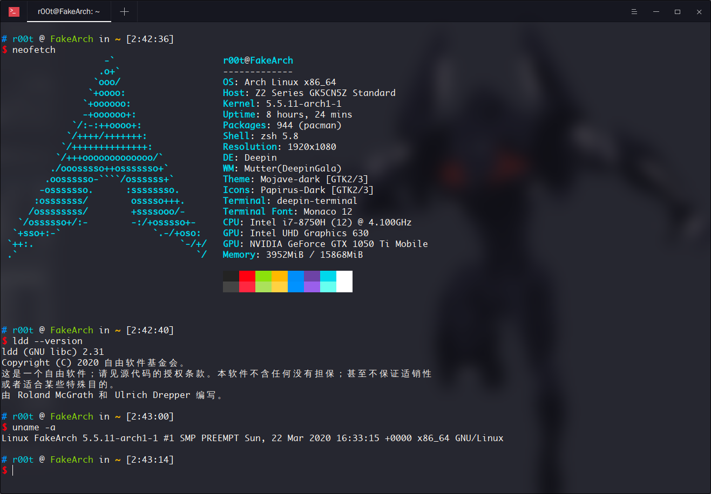
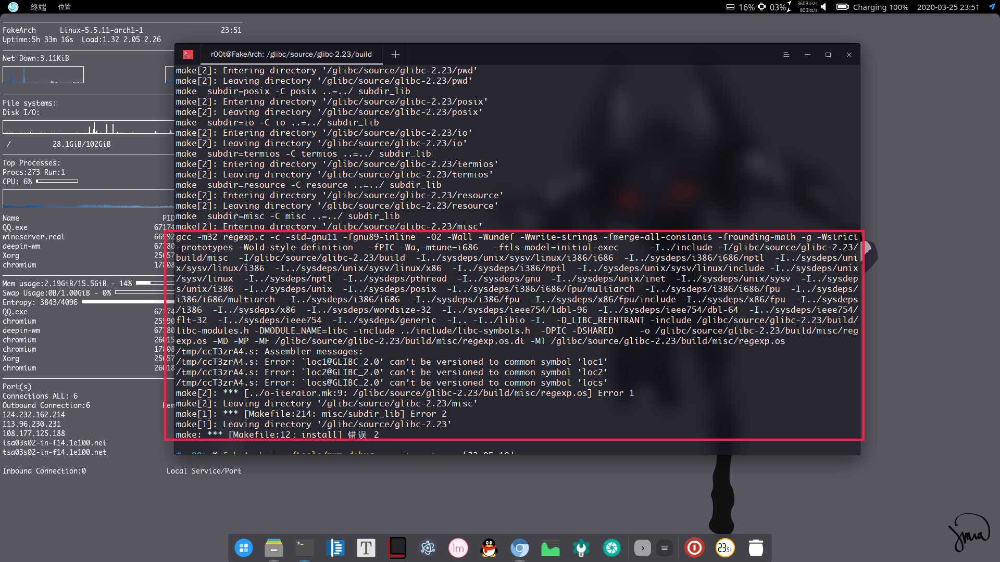
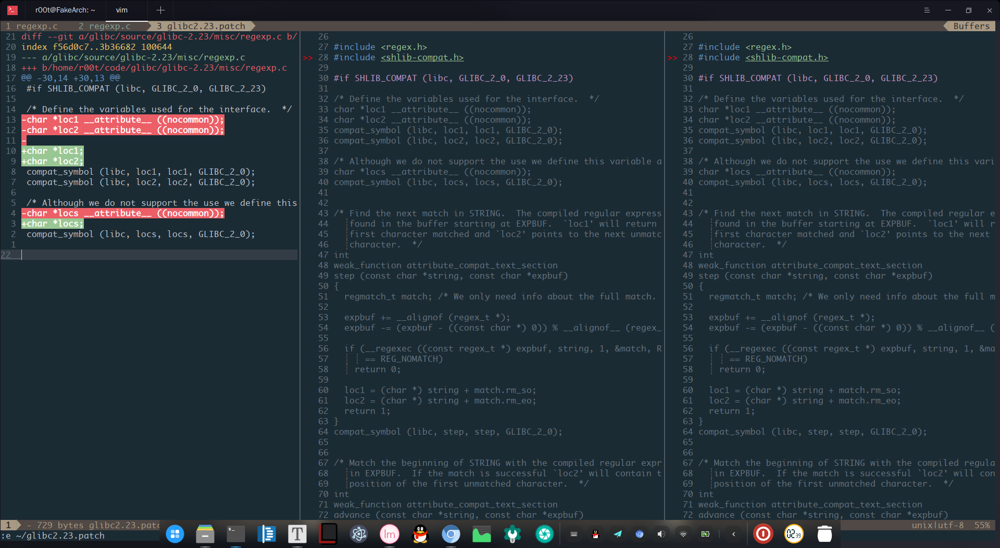
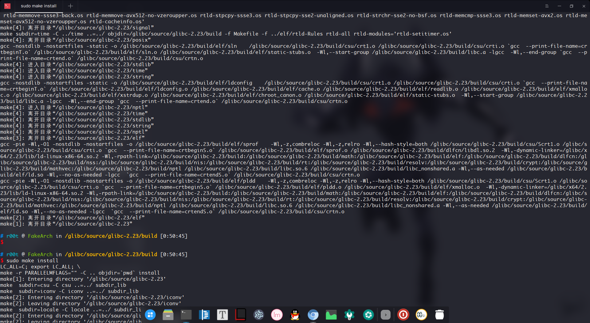
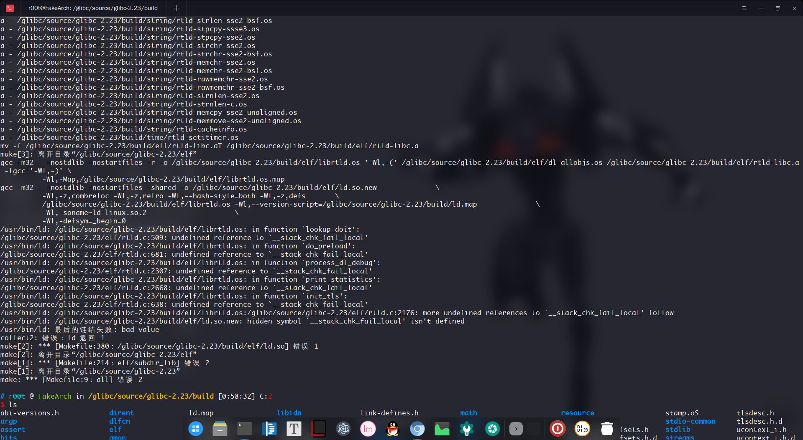
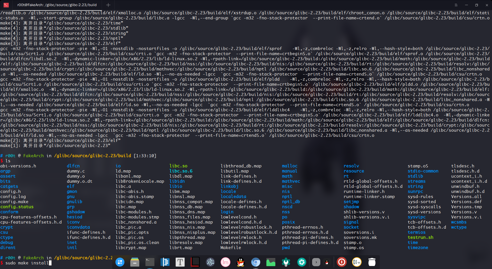
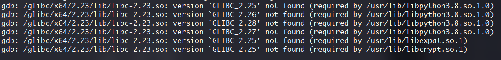
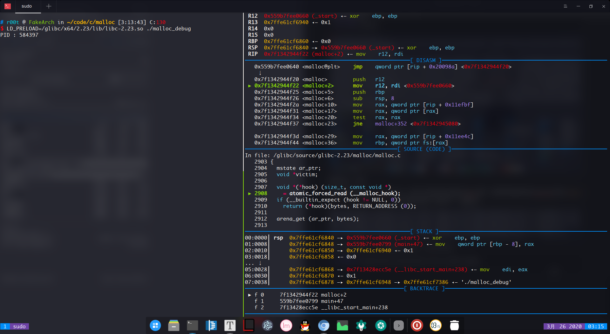

刚刚换了新系统（原本这些实验是在另一台电脑上做的）



今天编译 glibc，遇到的麻烦，以及解决方案

编译系统一样版本的 glibc 没有遇到问题，直接编译安装成功


这些问题是我在编译 glibc2.23 的时候遇到

1. 因为 汇编器 版本不同出的问题



这个问题我 patch 源码

我查到的 完整的 patch：

```
diff --git a/package/glibc/0005-fix-binutils-2-29-build.patch b/package/glibc/0005-fix-binutils-2-29-build.patch
new file mode 100644
index 0000000..47fcd2f
--- /dev/null
+++ b/package/glibc/0005-fix-binutils-2-29-build.patch
@@ -0,0 +1,65 @@ 
+From: H.J. Lu <hjl.tools@gmail.com>
+Date: Fri, 23 Jun 2017 21:38:46 +0000 (-0700)
+Subject: Avoid .symver on common symbols [BZ #21666]
+X-Git-Tag: glibc-2.26~241
+X-Git-Url: https://sourceware.org/git/gitweb.cgi?p=glibc.git;a=commitdiff_plain;h=388b4f1a02f3a801965028bbfcd48d905638b797
+
+Avoid .symver on common symbols [BZ #21666]
+
+The .symver directive on common symbol just creates a new common symbol,
+not an alias and the newer assembler with the bug fix for
+
+https://sourceware.org/bugzilla/show_bug.cgi?id=21661
+
+will issue an error.  Before the fix, we got
+
+$ readelf -sW libc.so | grep "loc[12s]"
+  5109: 00000000003a0608     8 OBJECT  LOCAL  DEFAULT   36 loc1
+  5188: 00000000003a0610     8 OBJECT  LOCAL  DEFAULT   36 loc2
+  5455: 00000000003a0618     8 OBJECT  LOCAL  DEFAULT   36 locs
+  6575: 00000000003a05f0     8 OBJECT  GLOBAL DEFAULT   36 locs@GLIBC_2.2.5
+  7156: 00000000003a05f8     8 OBJECT  GLOBAL DEFAULT   36 loc1@GLIBC_2.2.5
+  7312: 00000000003a0600     8 OBJECT  GLOBAL DEFAULT   36 loc2@GLIBC_2.2.5
+
+in libc.so.  The versioned loc1, loc2 and locs have the wrong addresses.
+After the fix, we got
+
+$ readelf -sW libc.so | grep "loc[12s]"
+  6570: 000000000039e3b8     8 OBJECT  GLOBAL DEFAULT   34 locs@GLIBC_2.2.5
+  7151: 000000000039e3c8     8 OBJECT  GLOBAL DEFAULT   34 loc1@GLIBC_2.2.5
+  7307: 000000000039e3c0     8 OBJECT  GLOBAL DEFAULT   34 loc2@GLIBC_2.2.5
+
+	[BZ #21666]
+	* misc/regexp.c (loc1): Add __attribute__ ((nocommon));
+	(loc2): Likewise.
+	(locs): Likewise.
+
+Signed-off-by: Thomas Petazzoni <thomas.petazzoni@free-electrons.com>
+[Backported from upstream commit
+388b4f1a02f3a801965028bbfcd48d905638b797, to fix the build with
+binutils 2.29.]
+---
+diff --git a/misc/regexp.c b/misc/regexp.c
+index 19d76c0..eaea7c3 100644
+--- a/misc/regexp.c
++++ b/misc/regexp.c
+@@ -29,14 +29,15 @@
+ 
+ #if SHLIB_COMPAT (libc, GLIBC_2_0, GLIBC_2_23)
+ 
+-/* Define the variables used for the interface.  */
+-char *loc1;
+-char *loc2;
++/* Define the variables used for the interface.  Avoid .symver on common
++   symbol, which just creates a new common symbol, not an alias.  */
++char *loc1 __attribute__ ((nocommon));
++char *loc2 __attribute__ ((nocommon));
+ compat_symbol (libc, loc1, loc1, GLIBC_2_0);
+ compat_symbol (libc, loc2, loc2, GLIBC_2_0);
+ 
+ /* Although we do not support the use we define this variable as well.  */
+-char *locs;
++char *locs __attribute__ ((nocommon));
+ compat_symbol (libc, locs, locs, GLIBC_2_0);
+ 
+ 
```

via：https://patchwork.ozlabs.org/patch/797471/

这个是我自己实际的 patch ：

```
diff --git a/glibc-2.23/misc/regexp.c b/glibc-2.23/misc/regexp.c
index f56d0c7..3b36682 100644
--- a/glibc-2.23/misc/regexp.c
+++ b/glibc-2.23/misc/regexp.c
@@ -30,14 +30,13 @@
 #if SHLIB_COMPAT (libc, GLIBC_2_0, GLIBC_2_23)
 
 /* Define the variables used for the interface.  */
-char *loc1 __attribute__ ((nocommon));
-char *loc2 __attribute__ ((nocommon));
-
+char *loc1;
+char *loc2;
 compat_symbol (libc, loc1, loc1, GLIBC_2_0);
 compat_symbol (libc, loc2, loc2, GLIBC_2_0);
 
 /* Although we do not support the use we define this variable as well.  */
-char *locs __attribute__ ((nocommon));
+char *locs;
 compat_symbol (libc, locs, locs, GLIBC_2_0);
```



patch 完编译，安装

```bash
sudo mkdir build
sudo cd build
sudo ../configure --prefix=/glibc/x64/2.23/ --disable-werror --enable-debug=yes
sudo make j8
sudo make install
```



x64 版 patch 完可以正常编译安装


2. 编译 x86 版的时候又出问题

```bash
mkdir build
cd build
sudo ../configure --prefix=/glibc/x86/2.23/ --disable-werror --enable-debug=yes --host=i686-linux-gnu --build=i686-linux-gnu CC="gcc -m32" CXX="g++ -m32"
```



看报错 __stack_chk_fail_local 

这个函数是栈保护 cannary 的一个函数

直接把栈保护关掉 -fno-stack-protector

```bash
sudo mkdir build
sudo cd build
sudo ../configure --prefix=/glibc/x86/2.23/ --disable-werror --enable-debug=yes --host=i686-linux-gnu --build=i686-linux-gnu CC="gcc -m32 -fno-stack-protector" CXX="g++ -m32 -fno-stack-protector"
sudo make j8
sudo make install
```



编译成功，安装

我的系统内核是 5.5，glibc是 2.31，有的工具是依赖比较高的 glibc 版本，像是刚刚编译好的 glibc2.23 直接 `export LD_LIBRARY_PATH = ` 的话会造成很多工具用不了，像是这个



解决方案是利用 preload 或者用 pwntools， pwn_debug

```bash
LD_PRELOAD=/glibc/x64/2.23/lib/libc-2.23.so malloc_debug
```



运行起来后再用 gdb attach 上去

pwntools 我就不演示了

