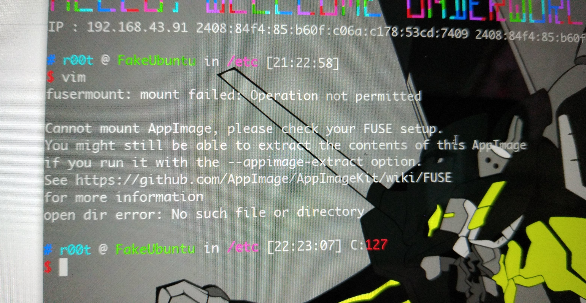

真××智障的一次操作

堪比上次我用 winrar 打包 winrar ，然后打包出：winrar.rar


今天编译完 glibc ，因为编译的时候用的是  `sudo make && make install`

安装的目录所有者变成 root

我原本是想 chown 目录的：

```bash
sudo chown -R r00t:r00t ./2.27-x86/*
```


我不知道是不是有毛病,打成了：

```bash
sudo chown -R r00t:r00t debug/2.27-x86 /*
```

回车

发现不对劲的时候直接 ctrl + c

```
ls -l /
```


发现 `bin`， `etc`， `cdrom`， `dev` 以及他们的所有子目录全所有者（组）全变成了 r00t:r00t

心凉半截

`sudo` 用不了，因为 `/etc/sudoers` 所有者（组）变成了 `r00t:r00t`

`su` 用不了


默默启动备用系统，把盘挂载上去，然后进入刚刚误操作的系统的盘的根目录：

记住别是当前系统的根目录，这样的话有你好玩的！！！！

记住别是当前系统的根目录，这样的话有你好玩的！！！！

记住别是当前系统的根目录，这样的话有你好玩的！！！！

然后：

```
sudo chown -R root:root ./etc
sudo chown -R root:root ./boot
sudo chown -R root:root ./cdrom
```


现在能开机了，也能进桌面了

试了一下 `sudo`

结果 sudo 出现：

sudo: unable to stat /etc/sudoers.d/0pwfeedback: Permission denied
sudo: unable to stat /etc/sudoers.d/README: Permission denied
sudo: unable to stat /etc/sudoers.d/mintupdate: Permission denied

```
$ sudo su
sudo: unable to stat /etc/sudoers.d/0pwfeedback: Permission denied
sudo: unable to stat /etc/sudoers.d/README: Permission denied
sudo: unable to stat /etc/sudoers.d/mintupdate: Permission denied
root@FakeUbuntu:/# chmod u=rwx,g=rx,o=rx /etc/sudoers.d/  
root@FakeUbuntu:/# chmod u=r,g=r,o= /etc/sudoers.d/*  
```

（好吧，这里会暴露我使用的发行版）


修复权限：

```bash
chown -R root:root /etc/sudoers.d
chmod u=rwx,g=rx,o=rx /etc/sudoers.d/
chmod u=r,g=r,o= /etc/sudoers.d/*
```


我决定看看天杀的 `chown` 源码，回溯 `chown` 的调用条件，盲猜是 `uid == 0`

一打开 nvim 



又把他妈骂了一顿，肯定是 `/etc` 的锅 

然后重新设置 fuse:

```bash
sudo modprobe fuse
sudo groupadd fuse

user="$(whoami)"
sudo usermod -a -G fuse $user
```


挣个事件下来，我想了个事

像是今天我的智障操作

```bash
sudo chown
```

其实 `chown` 这类命令，