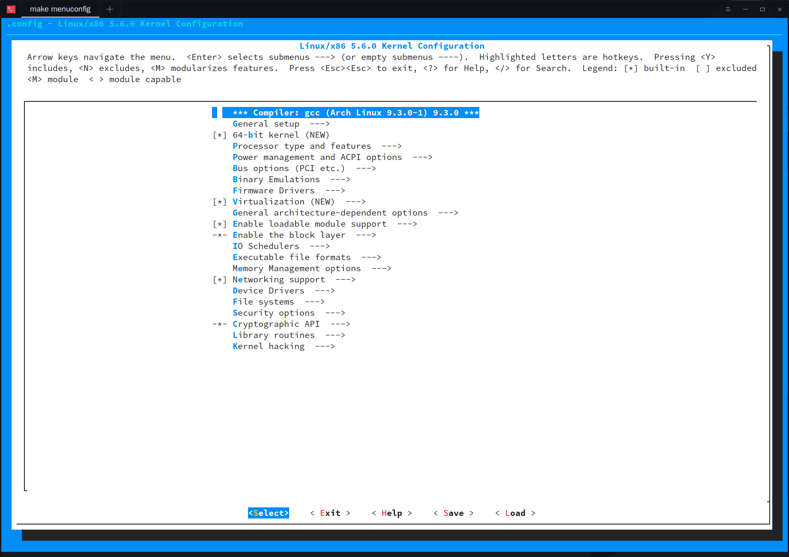
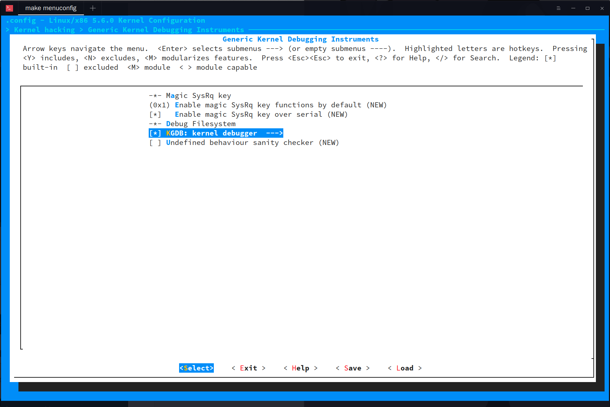
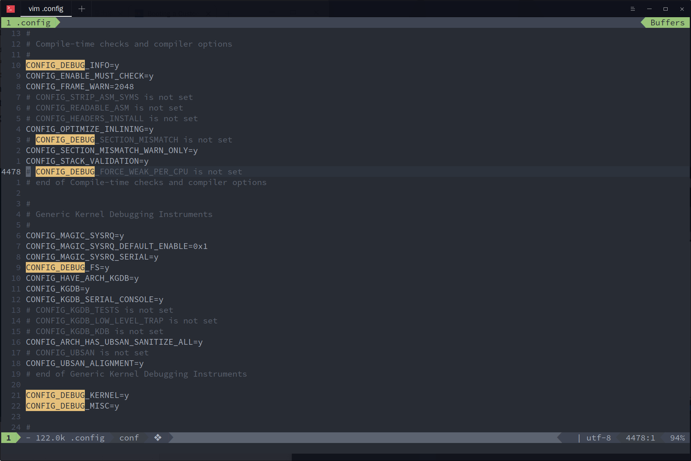
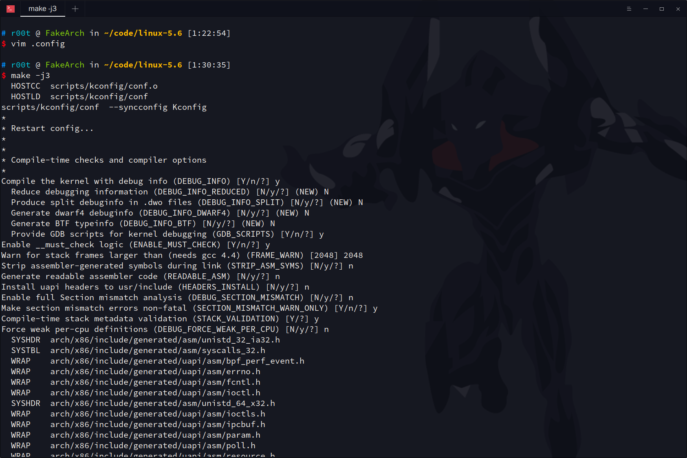
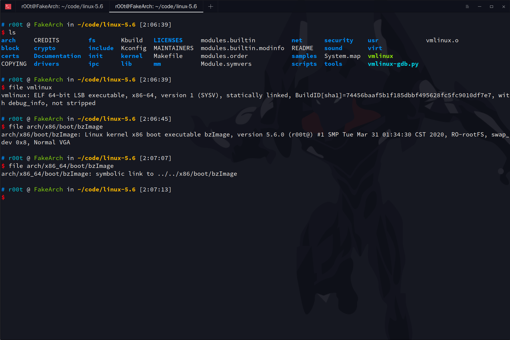
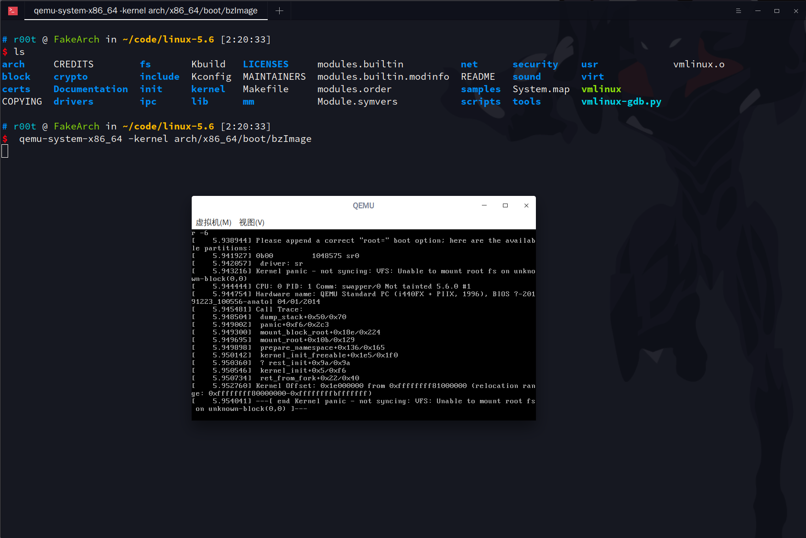
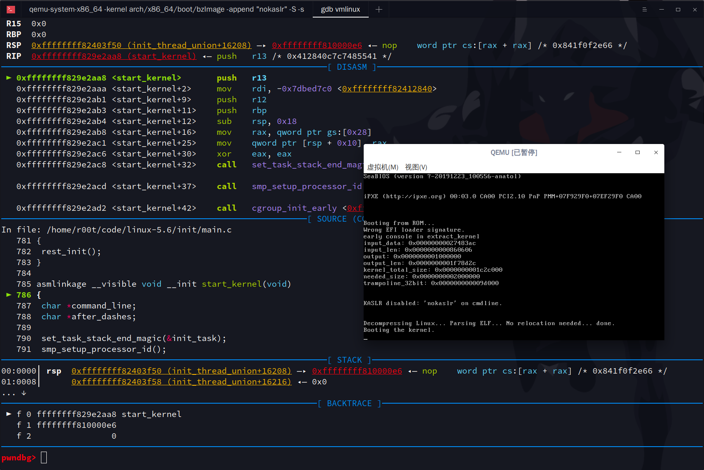

via：https://nickdesaulniers.github.io/blog/2018/10/24/booting-a-custom-linux-kernel-in-qemu-and-debugging-it-with-gdb/

先编译内核

```bash
make menuconfig
```



选择 `Kernel hacking ---> Generic Kernel Debugging Instruments ---> KGDB: kernel debugger ` 

这个只是在 linux 5.6 下面的选法，其他版本的可能会不一样，我编译过 5.5.9 就不一样，反正记得开 `KGDB` 选项



`save` 然后 `exit` 回到源码根目录

```bash
 ./scripts/config -e DEBUG_INFO -e GDB_SCRIPTS
```

查看 .config 文件



可以看见

```
CONFIG_DEBUG_INFO=y
```

说明配置成功

直接开始 `make`，这里的 j4 意思是使用 4 个线程，在我的主力机上 i7-8750H 12核 我开到 j9，反正看自己的实际情况定

```
make -j4 
```

然后可能会有下面的选项（我是这样选的）：



```
Compile the kernel with debug info (DEBUG_INFO) [Y/n/?] y
  Reduce debugging information (DEBUG_INFO_REDUCED) [N/y/?] (NEW) N
  Produce split debuginfo in .dwo files (DEBUG_INFO_SPLIT) [N/y/?] (NEW) N
  Generate dwarf4 debuginfo (DEBUG_INFO_DWARF4) [N/y/?] (NEW) N
  Generate BTF typeinfo (DEBUG_INFO_BTF) [N/y/?] (NEW) N
  Provide GDB scripts for kernel debugging (GDB_SCRIPTS) [Y/n/?] y
Enable __must_check logic (ENABLE_MUST_CHECK) [Y/n/?] y
Warn for stack frames larger than (needs gcc 4.4) (FRAME_WARN) [2048] 2048
Strip assembler-generated symbols during link (STRIP_ASM_SYMS) [N/y/?] n
Generate readable assembler code (READABLE_ASM) [N/y/?] n
Install uapi headers to usr/include (HEADERS_INSTALL) [N/y/?] n
Enable full Section mismatch analysis (DEBUG_SECTION_MISMATCH) [N/y/?] n
Make section mismatch errors non-fatal (SECTION_MISMATCH_WARN_ONLY) [Y/n/?] y
Compile-time stack metadata validation (STACK_VALIDATION) [Y/?] y
Force weak per-cpu definitions (DEBUG_FORCE_WEAK_PER_CPU) [N/y/?] n
```

选完就是一个等待的过程了，我现在用的是 3 线程，现在是：

```bash
# r00t @ FakeArch in ~/code/linux-5.6 [1:37:05] C:1
$ date +%s
1585589829
```

我先去睡觉，等编译完成我再继续写

我还没睡，编译完了，花了半个小时

```bash
# r00t @ FakeArch in ~/code/linux-5.6 [2:05:53] 
$ date +%s
1585591558
```




测试一下

```bash
 qemu-system-x86_64 -kernel arch/x86_64/boot/bzImage
```



正常

```bash
echo "add-auto-load-safe-path path/to/linux/scripts/gdb/vmlinux-gdb.py" >> ~/.gdbinit
```

加载 `gdb` 脚本（自己看好你的 `vmlinux-gdb.py` 的路径在哪，别直接运行）

测试一下 `gdb` 调试

```bash
qemu-system-x86_64 -kernel arch/x86_64/boot/bzImage -append "nokaslr" -S -s
```

```bash
gdb vmlinux
```

进去后直接 

```
target remote :1234
```

启动 `gdb` 远程调试，端口 `1234`（默认端口）

```bash
# r00t @ FakeArch in ~/code/linux-5.6 [2:34:45] 
$ gdb vmlinux
GNU gdb (GDB) 9.1
Copyright (C) 2020 Free Software Foundation, Inc.
License GPLv3+: GNU GPL version 3 or later <http://gnu.org/licenses/gpl.html>
This is free software: you are free to change and redistribute it.
There is NO WARRANTY, to the extent permitted by law.
Type "show copying" and "show warranty" for details.
This GDB was configured as "x86_64-pc-linux-gnu".
Type "show configuration" for configuration details.
For bug reporting instructions, please see:
<http://www.gnu.org/software/gdb/bugs/>.
Find the GDB manual and other documentation resources online at:
    <http://www.gnu.org/software/gdb/documentation/>.

For help, type "help".
Type "apropos word" to search for commands related to "word"...
pwndbg: loaded 172 commands. Type pwndbg [filter] for a list.
pwndbg: created $rebase, $ida gdb functions (can be used with print/break)
Reading symbols from vmlinux...
pwndbg> target remote :1234
```


多次点击 qemu 的 虚拟机 --> 暂停

出现


这个时候回到 `gdb` 交互，直接下 硬件断点 `hbreak`

```bash
hb start_kernel
```

然后 `c`



可以看到命中断点

现在可以确定编译出来的内核是可以进行源码级调试的，我们现在可以挂上一个程序或这文件系统产生我们想要的系统调用，然后跟踪源码理解

`linux` 在启动的时候会启动 0 号进程（init）所以我们直接写一个程序，将它编译成 `init`，然后用 `cpio` 打包 `qemu -initrd` 加载

具体步骤：

1. 静态编译（不管你用 c 还是 c++ 还是 rust 还是 Go，反正我用 C）

   ```bash
   gcc -static init.c -o init
   ```

   demo code：

   ```c
   #include <stdio.h>
   int main()
   {
     printf("hello, underworld! I am init\n");
     getchar();
     return 0;
   }
   ```

   compile：

   ```bash
   # r00t @ FakeArch in ~/code/linux-5.6/my_debug [16:09:18] 
   $ gcc -static init.c -o init
   
   # r00t @ FakeArch in ~/code/linux-5.6/my_debug [16:09:21] 
   $ strip init 
   
   # r00t @ FakeArch in ~/code/linux-5.6/my_debug [16:09:25] 
   $ file init
   init: ELF 64-bit LSB executable, x86-64, version 1 (GNU/Linux), statically linked, BuildID[sha1]=d61e569cc0f20dad092e1306acae8d2db08131f0, for GNU/Linux 3.2.0, stripped
   ```

   不使用静态链接的话会提示没有动态链接库，我们只打包 init 不打包 libc

2. 打包成 cpio 文档

   ```bash
   find . | cpio -o --format=newc > ../initrd.img
   ```

   cpio 打包

   ```bash
   # r00t @ FakeArch in ~/code/linux-5.6/my_debug [16:14:47] 
   $ ls
   init
   
   # r00t @ FakeArch in ~/code/linux-5.6/my_debug [16:14:48] 
   $ find . | cpio -o --format=newc > ../initrd.img
   1383 块
   
   # r00t @ FakeArch in ~/code/linux-5.6/my_debug [16:14:59] 
   $ file ../initrd.img 
   ../initrd.img: ASCII cpio archive (SVR4 with no CRC)
   ```

   

3. 用 qemu 载入启动

   ```bash
   qemu-system-x86_64 -kernel arch/x86_64/boot/bzImage -initrd initrd.img  -append "nokaslr" -S -s
   ```

   

   成功！
