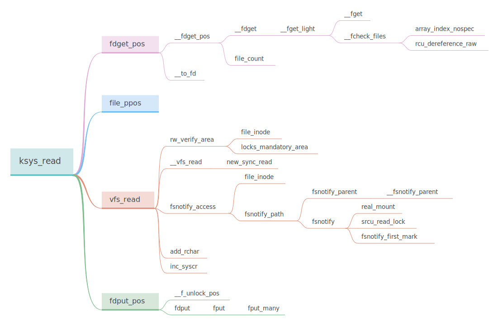

这几天一直在忙别的事，完事了，看了点文件系统相关的部分，就看看 `read` 在内核里面的实现

这是大概的函数调用链，但是我不会一个一个全部去分析，我只看主要的



man 手册描述

via：https://man7.org/linux/man-pages/man2/read.2.html

```
NAME
       read - read from a file descriptor

SYNOPSIS
       #include <unistd.h>

       ssize_t read(int fd, void *buf, size_t count);
       
DESCRIPTION
       read() attempts to read up to count bytes from file descriptor fd into the buffer starting at buf.

       On  files that support seeking, the read operation commences at the file offset, and the file offset is incremented by the number of bytes read.  If the file offset is at or past the end of file,      
       no bytes are read, and read() returns zero.

       If count is zero, read() may detect the errors described below.  In the absence of any errors, or if read() does not check for errors, a read() with a count of 0 returns zero and has no other ef‐      
       fects.

       According to POSIX.1, if count is greater than SSIZE_MAX, the result is implementation-defined; see NOTES for the upper limit on Linux.
```

从 文件描述符 读取文件内容

三个参数，对应 `SYSCALL_DEFINE3`

```c
SYSCALL_DEFINE3(read, unsigned int, fd, char __user *, buf, size_t, count)
{
	return ksys_read(fd, buf, count);
}
```

## ksys_read

@fd -- 文件描述符

n@buf -- 把指定长度的文件内容存入这个 `buf` 里面

@count -- 读取的长度

```c
ssize_t ksys_read(unsigned int fd, char __user *buf, size_t count)
{
    /* 传进来的是一个 int，现在要获取对应的 fd 结构
     * 像是 stdin 是一个 fd，对应的是 0
     */
	struct fd f = fdget_pos(fd);
    // EBADF : fd is not a valid file descriptor or is not open for reading.
    // fd 不是有效的文件描述符，或者没有打开进行读取。
	ssize_t ret = -EBADF;

	if (f.file) {
		loff_t pos, *ppos = file_ppos(f.file);
		if (ppos) {
			pos = *ppos;
			ppos = &pos;
		}
		ret = vfs_read(f.file, buf, count, ppos);
		if (ret >= 0 && ppos)
			f.file->f_pos = pos;
		fdput_pos(f);
	}
	return ret;
}
```

## fdget_pos

```c
static inline struct fd fdget_pos(int fd)
{
	return __to_fd(__fdget_pos(fd));
}
```

### __fdget_pos

```c
unsigned long __fdget_pos(unsigned int fd)
{
    // 获取 file 结构的地址
	unsigned long v = __fdget(fd);
	struct file *file = (struct file *)(v & ~3);

    // 如果需要对 f_pos 进行原子访问
	if (file && (file->f_mode & FMODE_ATOMIC_POS)) {
		if (file_count(file) > 1) {
			v |= FDPUT_POS_UNLOCK;
			mutex_lock(&file->f_pos_lock);
		}
	}
	return v;
}
```

### __fdget

```c
unsigned long __fdget(unsigned int fd)
{
	return __fget_light(fd, FMODE_PATH);
}
```

### __fget_light

```c
/*
 * Lightweight file lookup - no refcnt increment if fd table isn't shared.
 *
 * You can use this instead of fget if you satisfy all of the following
 * conditions:
 * 1) You must call fput_light before exiting the syscall and returning control
 *    to userspace (i.e. you cannot remember the returned struct file * after
 *    returning to userspace).
 * 2) You must not call filp_close on the returned struct file * in between
 *    calls to fget_light and fput_light.
 * 3) You must not clone the current task in between the calls to fget_light
 *    and fput_light.
 *
 * The fput_needed flag returned by fget_light should be passed to the
 * corresponding fput_light.
 */
static unsigned long __fget_light(unsigned int fd, fmode_t mask)
{
    // 获取当前进程的 files 结构（这个结构存储了打开的文件与进程交互的有关信息）
	struct files_struct *files = current->files;
	struct file *file;

    // count -- 使用该表的进程数
	if (atomic_read(&files->count) == 1) {
		file = __fcheck_files(files, fd);
		if (!file || unlikely(file->f_mode & mask))
			return 0;
		return (unsigned long)file;
	} else {
        // 跟多个进程共享 files 结构的时候
		file = __fget(fd, mask, 1);
		if (!file)
			return 0;
		return FDPUT_FPUT | (unsigned long)file;
	}
}
```


### __fget

跟多个进程共享 files 的时候

```c
static struct file *__fget(unsigned int fd, fmode_t mask, unsigned int refs)
{
	struct files_struct *files = current->files;
	struct file *file;

    // 设置一个 rcu 读取锁
	rcu_read_lock();
loop:
    // 循环去请求 file 结构
	file = fcheck_files(files, fd);
	if (file) {
		/* File object ref couldn't be taken.
		 * dup2() atomicity guarantee is the reason
		 * we loop to catch the new file (or NULL pointer)
		 */
		if (file->f_mode & mask)
			file = NULL;
		else if (!get_file_rcu_many(file, refs))
			goto loop;
	}
	rcu_read_unlock();

	return file;
}
```


### __fcheck_files

调用者必须确保 `fd` 表不共享，或者持有 `rcu` 或者 `文件锁`

```c
/*
 * The caller must ensure that fd table isn't shared or hold rcu or file lock
 */
static inline struct file *__fcheck_files(struct files_struct *files, unsigned int fd)
{
	struct fdtable *fdt = rcu_dereference_raw(files->fdt);

    // 检查 fd 是不是超出了最大限制（max_fds -- 可以分配的最大文件描述符数）
	if (fd < fdt->max_fds) {
		fd = array_index_nospec(fd, fdt->max_fds);
		return rcu_dereference_raw(fdt->fd[fd]);
	}
	return NULL;
}
```


------


### __to_fd

去掉 file 结构地址的 最低 2 bits 得到  fd 结构

```c
static inline struct fd __to_fd(unsigned long v)
{
	return (struct fd){(struct file *)(v & ~3),v & 3};
}
```


### file_ppos

获取 fd->file->f_pos

```c
/* file_ppos returns &file->f_pos or NULL if file is stream */
static inline loff_t *file_ppos(struct file *file)
{
	return file->f_mode & FMODE_STREAM ? NULL : &file->f_pos;
}
```


### vfs_read

```c
ssize_t vfs_read(struct file *file, char __user *buf, size_t count, loff_t *pos)
{
	ssize_t ret;

	if (!(file->f_mode & FMODE_READ))
		return -EBADF;
	if (!(file->f_mode & FMODE_CAN_READ))
		return -EINVAL;
	if (unlikely(!access_ok(buf, count)))
		return -EFAULT;

	ret = rw_verify_area(READ, file, pos, count);
	if (!ret) {
		if (count > MAX_RW_COUNT)
			count =  MAX_RW_COUNT;
		ret = __vfs_read(file, buf, count, pos);
		if (ret > 0) {
			fsnotify_access(file);
			add_rchar(current, ret);
		}
		inc_syscr(current);
	}

	return ret;
}
```

Flag:

```
#define	EBADF		 9	/* Bad file number */
#define	EFAULT		14	/* Bad address */
#define	EINVAL		22	/* Invalid argument */
```

```
/* file is open for reading */
#define FMODE_READ		((__force fmode_t)0x1)
/* Has read method(s) */
#define FMODE_CAN_READ          ((__force fmode_t)0x20000)
```


### rw_verify_area

```c
int rw_verify_area(int read_write, struct file *file, const loff_t *ppos, size_t count)
{
	struct inode *inode;
	int retval = -EINVAL;

    // 获取文件对应的 inode 结构
	inode = file_inode(file);
	if (unlikely((ssize_t) count < 0))
		return retval;

	/*
	 * ranged mandatory locking does not apply to streams - it makes sense
	 * only for files where position has a meaning.
	 */
	if (ppos) {
		loff_t pos = *ppos;

		if (unlikely(pos < 0)) {
			if (!unsigned_offsets(file))
				return retval;
			if (count >= -pos) /* both values are in 0..LLONG_MAX */
				return -EOVERFLOW;
		} else if (unlikely((loff_t) (pos + count) < 0)) {
			if (!unsigned_offsets(file))
				return retval;
		}

		if (unlikely(inode->i_flctx && mandatory_lock(inode))) {
			retval = locks_mandatory_area(inode, file, pos, pos + count - 1,
					read_write == READ ? F_RDLCK : F_WRLCK);
			if (retval < 0)
				return retval;
		}
	}

	return security_file_permission(file,
				read_write == READ ? MAY_READ : MAY_WRITE);
}
```


### __vfs_read

```c
ssize_t __vfs_read(struct file *file, char __user *buf, size_t count,
		   loff_t *pos)
{
	if (file->f_op->read)
		return file->f_op->read(file, buf, count, pos);
	else if (file->f_op->read_iter)
		return new_sync_read(file, buf, count, pos);
	else
		return -EINVAL;
}
```

调用到这里的时候 vfs 的工作就转交给 文件系统 的操作函数去做了

file->f_op 包含着文件系统对文件的操作函数

其实真正的读 read 操作是调用  file -> f_op -> read() 

这个 read 函数的操作是文件系统提供的

f _op  是一个 file_operations 结构体，里面包含着 函数指针，这些指针都是在文件系统注册的时候去初始化的

```c
struct file_operations {
	struct module *owner;
	loff_t (*llseek) (struct file *, loff_t, int);
	ssize_t (*read) (struct file *, char __user *, size_t, loff_t *);
	ssize_t (*write) (struct file *, const char __user *, size_t, loff_t *);
	ssize_t (*read_iter) (struct kiocb *, struct iov_iter *);
	ssize_t (*write_iter) (struct kiocb *, struct iov_iter *);
	int (*iopoll)(struct kiocb *kiocb, bool spin);
	int (*iterate) (struct file *, struct dir_context *);
	int (*iterate_shared) (struct file *, struct dir_context *);
	__poll_t (*poll) (struct file *, struct poll_table_struct *);
	long (*unlocked_ioctl) (struct file *, unsigned int, unsigned long);
	long (*compat_ioctl) (struct file *, unsigned int, unsigned long);
	int (*mmap) (struct file *, struct vm_area_struct *);
	unsigned long mmap_supported_flags;
	int (*open) (struct inode *, struct file *);
	int (*flush) (struct file *, fl_owner_t id);
	int (*release) (struct inode *, struct file *);
	int (*fsync) (struct file *, loff_t, loff_t, int datasync);
	int (*fasync) (int, struct file *, int);
	int (*lock) (struct file *, int, struct file_lock *);
	ssize_t (*sendpage) (struct file *, struct page *, int, size_t, loff_t *, int);
	unsigned long (*get_unmapped_area)(struct file *, unsigned long, unsigned long, unsigned long, unsigned long);
	int (*check_flags)(int);
	int (*flock) (struct file *, int, struct file_lock *);
	ssize_t (*splice_write)(struct pipe_inode_info *, struct file *, loff_t *, size_t, unsigned int);
	ssize_t (*splice_read)(struct file *, loff_t *, struct pipe_inode_info *, size_t, unsigned int);
	int (*setlease)(struct file *, long, struct file_lock **, void **);
	long (*fallocate)(struct file *file, int mode, loff_t offset,
			  loff_t len);
	void (*show_fdinfo)(struct seq_file *m, struct file *f);
#ifndef CONFIG_MMU
	unsigned (*mmap_capabilities)(struct file *);
#endif
	ssize_t (*copy_file_range)(struct file *, loff_t, struct file *,
			loff_t, size_t, unsigned int);
	loff_t (*remap_file_range)(struct file *file_in, loff_t pos_in,
				   struct file *file_out, loff_t pos_out,
				   loff_t len, unsigned int remap_flags);
	int (*fadvise)(struct file *, loff_t, loff_t, int);
} __randomize_layout;
```

