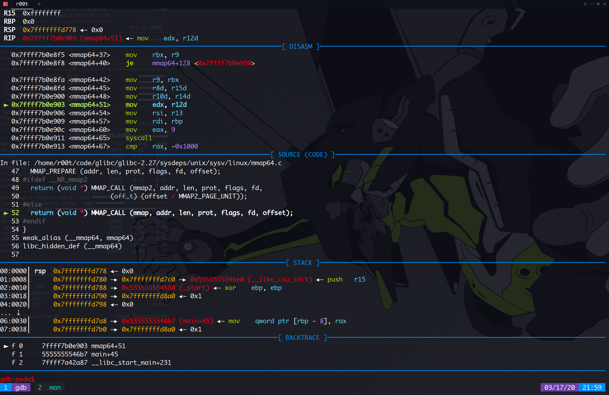

昨晚脑子抽了，突然想扒扒 `mmap`

## 映射文件

刚刚开始我是尝试 mmap 一个文件，实现对内存的读写达到读写文件内容的目的，踩了几个坑

```c
#include<stdio.h>
#include<unistd.h>
#include<sys/mman.h>
#include<sys/stat.h>
#include<sys/types.h>
#include<fcntl.h>
#include<string.h>

int main(int argc, char *argv[])
{
        struct stat st;
        void *ptr;
        int filesize;

        int fd = open("bin", O_RDWR);
        fstat(fd, &st);
        filesize = st.st_size;
        printf("%d\n", filesize);

        ptr = mmap(NULL, filesize, PROT_READ | PROT_WRITE, MAP_SHARED, fd, 0);
        close(fd);

        printf("%p\n", ptr);
        memset(ptr, 0x46, 10);
        msync(ptr, filesize, MS_SYNC);
        munmap(ptr, filesize);
        return 0;
}
```


1.  我想的是读写，然后我看文章的时候我看到的是：用 open 得到一个 文件描述符，demo 上写的是 

   ```c
   int fd = open("xxxx", O_RDONLY);
   ```

   我信了然后我也照写，后面我发现我怎么都不能映射成功，后面我才意识到 open 时我用的只读，然后 mmap 时用读写

   ```c
   ptr = mmap(NULL, filesize, PROT_READ | PROT_WRITE, MAP_SHARED, fd, 0);
   ```

   

2. 还有就是同步的问题，原本我的理解是对 ptr 指向的进行内存读写，系统会自动同步到文件，然而不是。一般来说,进程在映射空间中对共享内容的修改并不会直接写回到磁盘文件中,往往在调用munmap()之后才会同步输出到磁盘文件中.那么,在程序运行过 程中,在调用munmap()之前,可以通过调用msync()来实现磁盘上文件内容与共享内存区中的内容与一致，或者是把对共享内存区的修改同步输出到 磁盘文件中。


## 代码注入

完成后我还试了开一个 PROT_EXEC 权限的内存块去做代码注入

这里我又踩到坑，我在写 shellcode 的时候，可能是我太 sb 了，我是这样写的：

```assembly
section .data
	msg db      "hello, world!\r\n"
section .text
    global _start
_start:
    mov     rax, 1
    mov     rdi, 1
    mov     rsi, msg
    mov     rdx, 13
    syscall
    mov    rax, 60
    mov    rdi, 0
    syscall
```

编译

```
nasm -g -f elf64 shellcode.asm
ld shellcode.o -o shellocde
```

确实可以运行，然后我用 objdump 抠 shellcode 的时候发现，我没法抠下 msg ，因为它在 data 段，我只能抠 text 段的，我又想到把 msg 放在 text 段，但是我怎么去拿到它的地址？

后面我才知道有个技巧

via：https://stackoverflow.com/questions/15593214/linux-shellcode-hello-world

然后我把代码改成：

```assembly
section .text
    global _start
_start:
    call _exec
    msg db      "hello, world!\r\n"
    
_exec:
    mov     rax, 1
    mov     rdi, 1
    pop     rsi
    mov     rdx, 13
    syscall
    mov    rax, 60
    mov    rdi, 0
    syscall
```

其实这个，利用了 call 指令把 msg 的地址压栈

还是挺好理解的，就是 call 的时候会把下一条指令的地址当成 返回地址 压栈，这样在使用 pop 的时候就能得到这个地址

编译，抠 代码 ：

```shell
echo "\xe8\x11\x00\x00\x00\x68\x65\x6c\x6c\x6f\x2c\x20\x77\x6f\x72\x6c\x64\x21\x5c\x72\x5c\x6e\xb8\x01\x00\x00\x00\xbf\x01\x00\x00\x00\x5e\xba\x0d\x00\x00\x00\x0f\x05\xb8\x3c\x00\x00\x00\xbf\x00\x00\x00\x00\x0f\x05" > elf64
```

c source：

```c
#include<stdio.h>
#include<unistd.h>
#include<sys/mman.h>
#include<sys/stat.h>
#include<sys/types.h>
#include<fcntl.h>
#include<string.h>

int main(int argc, char *argv[])
{
        typedef void (*shellcode_t)();
        struct stat st;
        void *ptr;
        int filesize;

        int fp = open("elf64", O_RDWR);
        fstat(fp, &st);
        filesize = st.st_size;
        printf("%d\n", filesize);

        ptr = mmap(NULL, filesize, PROT_EXEC | PROT_READ | PROT_WRITE, MAP_SHARED, fp, 0);
        close(fp);
        printf("%p\n", ptr);
        
        shellcode_t f = (shellcode_t)ptr;
        f();
        
        munmap(ptr, filesize);
        return 0;
}
```


## 父子进程通讯

这里我用的是 mmap 匿名映射，所谓匿名映射，表示不存在 fd 这么个真实的文件，不需要映射真实文件

还有一种方法就是映射 /dev/zero

/dev/zero 是一个特殊的文件，当你读它的时候，它会提供无限的空字符(NULL, ASCII NUL, 0x00)
 一个作用是用它作为源，产生一个特定大小的空白文件

```c
#include<stdio.h>
#include<unistd.h>
#include<sys/mman.h>
#include<sys/stat.h>
#include<sys/types.h>

int main(int argc, char *argv[])
{
        char *ptr;
        ptr = (char *)mmap(NULL, 100, PROT_READ | PROT_WRITE, MAP_SHARED|MAP_ANON, -1, 0);

        printf("%p\n", ptr);
        if(fork() == 0) {
                sleep(1);
                printf("chlid got a message: %s\n", ptr);
                sprintf(ptr, "%s", "I am your son");
                munmap(ptr, 100);
        }

        sprintf(ptr, "%s" ,"I am your father");
        sleep(3);
        printf("father got a message: %s\n", ptr);
        return 0;
}
```

这个原理就是，fork 是子进程会 复制（当然是写时复制 COW，这个不展开） 父进程的东西，但是 mmap 得到的这块内存是父子进程共同维护的，对这块内存进行读写就能实现进程通信


## 源码分析

用法大概试了个遍，我直接追源码

写了个 demo 配合自己编译的 libc

```c
#include<stdio.h>
#include<sys/mman.h>
#include<unistd.h>

int main()
{
        void *p = mmap(NULL, 100, PROT_READ | PROT_EXEC | PROT_WRITE, MAP_ANON | MAP_SHARED, -1, 0);
        printf("%p\n", p);
        return 0;
}
```


gdb 调试



其实在用户层没有什么东西，看 diasm 窗口最后就是使用一个系统调用：

```asm
   0x7ffff7b0e8fa <mmap64+42>    mov    r9, rbx
   0x7ffff7b0e8fd <mmap64+45>    mov    r8d, r15d
   0x7ffff7b0e900 <mmap64+48>    mov    r10d, r14d
   0x7ffff7b0e903 <mmap64+51>    mov    edx, r12d
   0x7ffff7b0e906 <mmap64+54>    mov    rsi, r13
   0x7ffff7b0e909 <mmap64+57>    mov    rdi, rbp
   0x7ffff7b0e90c <mmap64+60>    mov    eax, 9
   0x7ffff7b0e911 <mmap64+65>    syscall 
```

C source code：

位于 glibc 源码： sysdeps/unix/sysv/linux/mmap64.c

```c
/* To avoid silent truncation of offset when using mmap2, do not accept
   offset larger than 1 << (page_shift + off_t bits).  For archictures with
   32 bits off_t and page size of 4096 it would be 1^44.  */
#define MMAP_OFF_HIGH_MASK \
  ((-(MMAP2_PAGE_UNIT << 1) << (8 * sizeof (off_t) - 1)))

#define MMAP_OFF_MASK (MMAP_OFF_HIGH_MASK | MMAP_OFF_LOW_MASK)

/* An architecture may override this.  */
#ifndef MMAP_PREPARE
# define MMAP_PREPARE(addr, len, prot, flags, fd, offset)
#endif

void *
__mmap64 (void *addr, size_t len, int prot, int flags, int fd, off64_t offset)
{
  MMAP_CHECK_PAGE_UNIT ();

  if (offset & MMAP_OFF_MASK)
    return (void *) INLINE_SYSCALL_ERROR_RETURN_VALUE (EINVAL);

  MMAP_PREPARE (addr, len, prot, flags, fd, offset);
#ifdef __NR_mmap2
  return (void *) MMAP_CALL (mmap2, addr, len, prot, flags, fd,
			     (off_t) (offset / MMAP2_PAGE_UNIT));
#else
  return (void *) MMAP_CALL (mmap, addr, len, prot, flags, fd, offset);
#endif
}
weak_alias (__mmap64, mmap64)
libc_hidden_def (__mmap64)
```

在用户层就是那么多东西

就是一个 9 号系统调用

cat /usr/include/asm/unistd_64.h

查到

```c
#define __NR_mmap 9
```


现在追进内核

**9** 号系统调用有 **6** 个参数（其实可以利用这个去查找因为是 6 个参数所以 搜索 SYSCALL_DEFINE6(mmap 这里的 6 就是描述参数  )

然后找到：

```c
SYSCALL_DEFINE6(mmap_pgoff, unsigned long, addr, unsigned long, len,
		unsigned long, prot, unsigned long, flags,
		unsigned long, fd, unsigned long, pgoff)
{
	return ksys_mmap_pgoff(addr, len, prot, flags, fd, pgoff);
}
```

这个方法用 vscode 的人比较方便操作


因为我是用 vim + gtags 

在内核里面找系统调用

我用的是 5.4 的 kernel 

我查看 arch/x86/entry/syscalls/syscall_64.tbl

```
9	common	mmap			__x64_sys_mmap
```

看到是 sys_mmap

直接跳到 sys_mmap 函数

arch/ia64/kernel/sys_ia64.c

```c
asmlinkage unsigned long
sys_mmap2 (unsigned long addr, unsigned long len, int prot, int flags, int fd, long pgoff)
{
	addr = ksys_mmap_pgoff(addr, len, prot, flags, fd, pgoff);
	if (!IS_ERR((void *) addr))
		force_successful_syscall_return();
	return addr;
}

asmlinkage unsigned long
sys_mmap (unsigned long addr, unsigned long len, int prot, int flags, int fd, long off)
{
	if (offset_in_page(off) != 0)
		return -EINVAL;

	addr = ksys_mmap_pgoff(addr, len, prot, flags, fd, off >> PAGE_SHIFT);
	if (!IS_ERR((void *) addr))
		force_successful_syscall_return();
	return addr;
}
```

跟下去：
mm/mmap.c

```c
unsigned long ksys_mmap_pgoff(unsigned long addr, unsigned long len,
			      unsigned long prot, unsigned long flags,
			      unsigned long fd, unsigned long pgoff)
{
	struct file *file = NULL;
	unsigned long retval;

	addr = untagged_addr(addr);

    //判断是不是匿名映射
	if (!(flags & MAP_ANONYMOUS)) {
		audit_mmap_fd(fd, flags);
		file = fget(fd);
		if (!file)
			return -EBADF;
		if (is_file_hugepages(file))
			len = ALIGN(len, huge_page_size(hstate_file(file)));
		retval = -EINVAL;
		if (unlikely(flags & MAP_HUGETLB && !is_file_hugepages(file)))
			goto out_fput;
	} else if (flags & MAP_HUGETLB) {
		struct user_struct *user = NULL;
		struct hstate *hs;

		hs = hstate_sizelog((flags >> MAP_HUGE_SHIFT) & MAP_HUGE_MASK);
		if (!hs)
			return -EINVAL;

		len = ALIGN(len, huge_page_size(hs));
		/*
		 * VM_NORESERVE is used because the reservations will be
		 * taken when vm_ops->mmap() is called
		 * A dummy user value is used because we are not locking
		 * memory so no accounting is necessary
		 */
		file = hugetlb_file_setup(HUGETLB_ANON_FILE, len,
				VM_NORESERVE,
				&user, HUGETLB_ANONHUGE_INODE,
				(flags >> MAP_HUGE_SHIFT) & MAP_HUGE_MASK);
		if (IS_ERR(file))
			return PTR_ERR(file);
	}

	flags &= ~(MAP_EXECUTABLE | MAP_DENYWRITE);

	retval = vm_mmap_pgoff(file, addr, len, prot, flags, pgoff);
out_fput:
	if (file)
		fput(file);
	return retval;
}

SYSCALL_DEFINE6(mmap_pgoff, unsigned long, addr, unsigned long, len,
		unsigned long, prot, unsigned long, flags,
		unsigned long, fd, unsigned long, pgoff)
{
	return ksys_mmap_pgoff(addr, len, prot, flags, fd, pgoff);
}
```


mm/util.c

vm_mmap_pgoff

```c
unsigned long vm_mmap_pgoff(struct file *file, unsigned long addr,
	unsigned long len, unsigned long prot,
	unsigned long flag, unsigned long pgoff)
{
	unsigned long ret;
    //获得 描述 当前进程 内存 的 mm_struct
	struct mm_struct *mm = current->mm;
	unsigned long populate;
	LIST_HEAD(uf);

	ret = security_mmap_file(file, prot, flag);
    
	if (!ret) {
		if (down_write_killable(&mm->mmap_sem))
			return -EINTR;
		ret = do_mmap_pgoff(file, addr, len, prot, flag, pgoff,
				    &populate, &uf);
		up_write(&mm->mmap_sem);
		userfaultfd_unmap_complete(mm, &uf);
		if (populate)
			mm_populate(ret, populate);
	}
	return ret;
}
```


security_mmap_file

```c
int security_mmap_file(struct file *file, unsigned long prot,
			unsigned long flags)
{
	int ret;
    //这个相当调用了 mmap_file 函数，这里的 call_int_hook 是这样定义的：
   /*
   #define call_int_hook(FUNC, IRC, ...) ({			\
	int RC = IRC;						\
	do {							\
		struct security_hook_list *P;			\
								\
		hlist_for_each_entry(P, &security_hook_heads.FUNC, list) { \
			RC = P->hook.FUNC(__VA_ARGS__);		\
			if (RC != 0)				\
				break;				\
		}						\
	} while (0);						\
	RC;							\
})
首先是一个 security_hook_list 结构体
在里面找到了 security_list_options 结构体
在 security_list_options 里面有 mmap_file 函数指针
hlist_for_each_entry  哈希表
security_hook_heads 里面有	struct hlist_head mmap_file;
看的我烦死，反正就是他妈的调用了mmap_file，__VA_ARGS__，把后面的参数（...）传给 mmap_file
看代码比看我描述简单
*/
    
	ret = call_int_hook(mmap_file, 0, file, prot,
					mmap_prot(file, prot), flags);
	if (ret)
		return ret;
	return ima_file_mmap(file, prot);
}
```


mmap_prot （用来处理 prot 参数）

```c
static inline unsigned long mmap_prot(struct file *file, unsigned long prot)
{
	/*
	 * Does we have PROT_READ and does the application expect
	 * it to imply PROT_EXEC?  If not, nothing to talk about...
	 */
    //自己看上面的英文注释
	if ((prot & (PROT_READ | PROT_EXEC)) != PROT_READ)
		return prot;
	if (!(current->personality & READ_IMPLIES_EXEC))
		return prot;
	/*
	 * if that's an anonymous mapping, let it.
	 */
	if (!file)
		return prot | PROT_EXEC;
	/*
	 * ditto if it's not on noexec mount, except that on !MMU we need
	 * NOMMU_MAP_EXEC (== VM_MAYEXEC) in this case
	 */
	if (!path_noexec(&file->f_path)) {
#ifndef CONFIG_MMU
		if (file->f_op->mmap_capabilities) {
			unsigned caps = file->f_op->mmap_capabilities(file);
			if (!(caps & NOMMU_MAP_EXEC))
				return prot;
		}
#endif
		return prot | PROT_EXEC;
	}
	/* anything on noexec mount won't get PROT_EXEC */
	return prot;
}
```


mmap_file

```c
static void *mmap_file(char const *fname)
{
	/* Avoid problems if early cleanup() */
	fd_map = -1;
	mmap_failed = 1;
	file_map = NULL;
	file_ptr = NULL;
	file_updated = 0;
	sb.st_size = 0;

	fd_map = open(fname, O_RDONLY);
	if (fd_map < 0) {
		perror(fname);
		return NULL;
	}
	if (fstat(fd_map, &sb) < 0) {
		perror(fname);
		goto out;
	}
	if (!S_ISREG(sb.st_mode)) {
		fprintf(stderr, "not a regular file: %s\n", fname);
		goto out;
	}
	file_map = mmap(0, sb.st_size, PROT_READ|PROT_WRITE, MAP_PRIVATE,
			fd_map, 0);
	if (file_map == MAP_FAILED) {
		mmap_failed = 1;
		file_map = umalloc(sb.st_size);
		if (!file_map) {
			perror(fname);
			goto out;
		}
		if (read(fd_map, file_map, sb.st_size) != sb.st_size) {
			perror(fname);
			free(file_map);
			file_map = NULL;
			goto out;
		}
	} else
		mmap_failed = 0;
out:
	close(fd_map);
	fd_map = -1;

	file_end = file_map + sb.st_size;

	return file_map;
}
```


主要的函数调用路线是这样的：

vm_mmap_pgoff -> do_mmap_pgoff -> do_mmap -> mmap_region

主要就是后面两个函数

```c
unsigned long do_mmap(struct file *file, unsigned long addr,
			unsigned long len, unsigned long prot,
			unsigned long flags, vm_flags_t vm_flags,
			unsigned long pgoff, unsigned long *populate,
			struct list_head *uf)
{
	struct mm_struct *mm = current->mm;
	int pkey = 0;

	*populate = 0;

	if (!len)
		return -EINVAL;

	/*
	 * Does the application expect PROT_READ to imply PROT_EXEC?
	 *
	 * (the exception is when the underlying filesystem is noexec
	 *  mounted, in which case we dont add PROT_EXEC.)
	 */
    //判断权限，看上面的注释（懒得翻译）
	if ((prot & PROT_READ) && (current->personality & READ_IMPLIES_EXEC))
		if (!(file && path_noexec(&file->f_path)))
			prot |= PROT_EXEC;

	/* force arch specific MAP_FIXED handling in get_unmapped_area */
	if (flags & MAP_FIXED_NOREPLACE)
		flags |= MAP_FIXED;

	if (!(flags & MAP_FIXED))
		addr = round_hint_to_min(addr);

	/* Careful about overflows.. */
    /*判断溢出*/
	len = PAGE_ALIGN(len);
	if (!len)
		return -ENOMEM;

	/* offset overflow? */
	if ((pgoff + (len >> PAGE_SHIFT)) < pgoff)
		return -EOVERFLOW;

	/* Too many mappings? */
    /*mmap 内存空间过大*/
	if (mm->map_count > sysctl_max_map_count)
		return -ENOMEM;

	/* Obtain the address to map to. we verify (or select) it and ensure
	 * that it represents a valid section of the address space.
	 */
	addr = get_unmapped_area(file, addr, len, pgoff, flags);
	if (offset_in_page(addr))
		return addr;

	if (flags & MAP_FIXED_NOREPLACE) {
		struct vm_area_struct *vma = find_vma(mm, addr);

		if (vma && vma->vm_start < addr + len)
			return -EEXIST;
	}

	if (prot == PROT_EXEC) {
		pkey = execute_only_pkey(mm);
		if (pkey < 0)
			pkey = 0;
	}

	/* Do simple checking here so the lower-level routines won't have
	 * to. we assume access permissions have been handled by the open
	 * of the memory object, so we don't do any here.
	 */
	vm_flags |= calc_vm_prot_bits(prot, pkey) | calc_vm_flag_bits(flags) |
			mm->def_flags | VM_MAYREAD | VM_MAYWRITE | VM_MAYEXEC;

	if (flags & MAP_LOCKED)
		if (!can_do_mlock())
			return -EPERM;

	if (mlock_future_check(mm, vm_flags, len))
		return -EAGAIN;

	if (file) {
		struct inode *inode = file_inode(file);
		unsigned long flags_mask;

		if (!file_mmap_ok(file, inode, pgoff, len))
			return -EOVERFLOW;

		flags_mask = LEGACY_MAP_MASK | file->f_op->mmap_supported_flags;

		switch (flags & MAP_TYPE) {
		case MAP_SHARED:
			/*
			 * Force use of MAP_SHARED_VALIDATE with non-legacy
			 * flags. E.g. MAP_SYNC is dangerous to use with
			 * MAP_SHARED as you don't know which consistency model
			 * you will get. We silently ignore unsupported flags
			 * with MAP_SHARED to preserve backward compatibility.
			 */
			flags &= LEGACY_MAP_MASK;
			/* fall through */
		case MAP_SHARED_VALIDATE:
			if (flags & ~flags_mask)
				return -EOPNOTSUPP;
			if (prot & PROT_WRITE) {
				if (!(file->f_mode & FMODE_WRITE))
					return -EACCES;
				if (IS_SWAPFILE(file->f_mapping->host))
					return -ETXTBSY;
			}

			/*
			 * Make sure we don't allow writing to an append-only
			 * file..
			 */
			if (IS_APPEND(inode) && (file->f_mode & FMODE_WRITE))
				return -EACCES;

			/*
			 * Make sure there are no mandatory locks on the file.
			 */
			if (locks_verify_locked(file))
				return -EAGAIN;

			vm_flags |= VM_SHARED | VM_MAYSHARE;
			if (!(file->f_mode & FMODE_WRITE))
				vm_flags &= ~(VM_MAYWRITE | VM_SHARED);

			/* fall through */
		case MAP_PRIVATE:
			if (!(file->f_mode & FMODE_READ))
				return -EACCES;
			if (path_noexec(&file->f_path)) {
				if (vm_flags & VM_EXEC)
					return -EPERM;
				vm_flags &= ~VM_MAYEXEC;
			}

			if (!file->f_op->mmap)
				return -ENODEV;
			if (vm_flags & (VM_GROWSDOWN|VM_GROWSUP))
				return -EINVAL;
			break;

		default:
			return -EINVAL;
		}
	} else {
		switch (flags & MAP_TYPE) {
		case MAP_SHARED:
			if (vm_flags & (VM_GROWSDOWN|VM_GROWSUP))
				return -EINVAL;
			/*
			 * Ignore pgoff.
			 */
			pgoff = 0;
			vm_flags |= VM_SHARED | VM_MAYSHARE;
			break;
		case MAP_PRIVATE:
			/*
			 * Set pgoff according to addr for anon_vma.
			 */
			pgoff = addr >> PAGE_SHIFT;
			break;
		default:
			return -EINVAL;
		}
	}

	/*
	 * Set 'VM_NORESERVE' if we should not account for the
	 * memory use of this mapping.
	 */
	if (flags & MAP_NORESERVE) {
		/* We honor MAP_NORESERVE if allowed to overcommit */
		if (sysctl_overcommit_memory != OVERCOMMIT_NEVER)
			vm_flags |= VM_NORESERVE;

		/* hugetlb applies strict overcommit unless MAP_NORESERVE */
		if (file && is_file_hugepages(file))
			vm_flags |= VM_NORESERVE;
	}

	addr = mmap_region(file, addr, len, vm_flags, pgoff, uf);
	if (!IS_ERR_VALUE(addr) &&
	    ((vm_flags & VM_LOCKED) ||
	     (flags & (MAP_POPULATE | MAP_NONBLOCK)) == MAP_POPULATE))
		*populate = len;
	return addr;
}
```


mmap_region

```c
unsigned long mmap_region(struct file *file, unsigned long addr,
		unsigned long len, vm_flags_t vm_flags, unsigned long pgoff,
		struct list_head *uf)
{
	struct mm_struct *mm = current->mm;
	struct vm_area_struct *vma, *prev;
	int error;
	struct rb_node **rb_link, *rb_parent;
	unsigned long charged = 0;

	/* Check against address space limit. */
	if (!may_expand_vm(mm, vm_flags, len >> PAGE_SHIFT)) {
		unsigned long nr_pages;

		/*
		 * MAP_FIXED may remove pages of mappings that intersects with
		 * requested mapping. Account for the pages it would unmap.
		 */
		nr_pages = count_vma_pages_range(mm, addr, addr + len);

		if (!may_expand_vm(mm, vm_flags,
					(len >> PAGE_SHIFT) - nr_pages))
			return -ENOMEM;
	}

	/* Clear old maps */
	while (find_vma_links(mm, addr, addr + len, &prev, &rb_link,
			      &rb_parent)) {
		if (do_munmap(mm, addr, len, uf))
			return -ENOMEM;
	}

	/*
	 * Private writable mapping: check memory availability
	 */
	if (accountable_mapping(file, vm_flags)) {
		charged = len >> PAGE_SHIFT;
		if (security_vm_enough_memory_mm(mm, charged))
			return -ENOMEM;
		vm_flags |= VM_ACCOUNT;
	}

	/*
	 * Can we just expand an old mapping?
	 */
	vma = vma_merge(mm, prev, addr, addr + len, vm_flags,
			NULL, file, pgoff, NULL, NULL_VM_UFFD_CTX);
	if (vma)
		goto out;

	/*
	 * Determine the object being mapped and call the appropriate
	 * specific mapper. the address has already been validated, but
	 * not unmapped, but the maps are removed from the list.
	 */
	vma = vm_area_alloc(mm);
	if (!vma) {
		error = -ENOMEM;
		goto unacct_error;
	}

	vma->vm_start = addr;
	vma->vm_end = addr + len;
	vma->vm_flags = vm_flags;
	vma->vm_page_prot = vm_get_page_prot(vm_flags);
	vma->vm_pgoff = pgoff;

	if (file) {
		if (vm_flags & VM_DENYWRITE) {
			error = deny_write_access(file);
			if (error)
				goto free_vma;
		}
		if (vm_flags & VM_SHARED) {
			error = mapping_map_writable(file->f_mapping);
			if (error)
				goto allow_write_and_free_vma;
		}

		/* ->mmap() can change vma->vm_file, but must guarantee that
		 * vma_link() below can deny write-access if VM_DENYWRITE is set
		 * and map writably if VM_SHARED is set. This usually means the
		 * new file must not have been exposed to user-space, yet.
		 */
		vma->vm_file = get_file(file);
		error = call_mmap(file, vma);
		if (error)
			goto unmap_and_free_vma;

		/* Can addr have changed??
		 *
		 * Answer: Yes, several device drivers can do it in their
		 *         f_op->mmap method. -DaveM
		 * Bug: If addr is changed, prev, rb_link, rb_parent should
		 *      be updated for vma_link()
		 */
		WARN_ON_ONCE(addr != vma->vm_start);

		addr = vma->vm_start;
		vm_flags = vma->vm_flags;
	} else if (vm_flags & VM_SHARED) {
		error = shmem_zero_setup(vma);
		if (error)
			goto free_vma;
	} else {
		vma_set_anonymous(vma);
	}

	vma_link(mm, vma, prev, rb_link, rb_parent);
	/* Once vma denies write, undo our temporary denial count */
	if (file) {
		if (vm_flags & VM_SHARED)
			mapping_unmap_writable(file->f_mapping);
		if (vm_flags & VM_DENYWRITE)
			allow_write_access(file);
	}
	file = vma->vm_file;
out:
	perf_event_mmap(vma);

	vm_stat_account(mm, vm_flags, len >> PAGE_SHIFT);
	if (vm_flags & VM_LOCKED) {
		if ((vm_flags & VM_SPECIAL) || vma_is_dax(vma) ||
					is_vm_hugetlb_page(vma) ||
					vma == get_gate_vma(current->mm))
			vma->vm_flags &= VM_LOCKED_CLEAR_MASK;
		else
			mm->locked_vm += (len >> PAGE_SHIFT);
	}

	if (file)
		uprobe_mmap(vma);

	/*
	 * New (or expanded) vma always get soft dirty status.
	 * Otherwise user-space soft-dirty page tracker won't
	 * be able to distinguish situation when vma area unmapped,
	 * then new mapped in-place (which must be aimed as
	 * a completely new data area).
	 */
	vma->vm_flags |= VM_SOFTDIRTY;

	vma_set_page_prot(vma);

	return addr;

unmap_and_free_vma:
	vma->vm_file = NULL;
	fput(file);

	/* Undo any partial mapping done by a device driver. */
	unmap_region(mm, vma, prev, vma->vm_start, vma->vm_end);
	charged = 0;
	if (vm_flags & VM_SHARED)
		mapping_unmap_writable(file->f_mapping);
allow_write_and_free_vma:
	if (vm_flags & VM_DENYWRITE)
		allow_write_access(file);
free_vma:
	vm_area_free(vma);
unacct_error:
	if (charged)
		vm_unacct_memory(charged);
	return error;
}
```


这里涉及的面有点庞大，全部追踪下去的话还会设计 文件 的部分。我就简单描述一下，其实 mmap 的最终 映射的内存是由 vm_area_struct  来描述，里面有两个指针：vm_start， vm_end，描述映射区的起始地址和结束地址

```c
	vma = vm_area_alloc(mm);
	if (!vma) {
		error = -ENOMEM;
		goto unacct_error;
	}

	vma->vm_start = addr;
	vma->vm_end = addr + len;
	vma->vm_flags = vm_flags;
	vma->vm_page_prot = vm_get_page_prot(vm_flags);
	vma->vm_pgoff = pgoff;
```


里面提到  current- > mm 这个 current 就是描述当先进程信息的 task_struct

