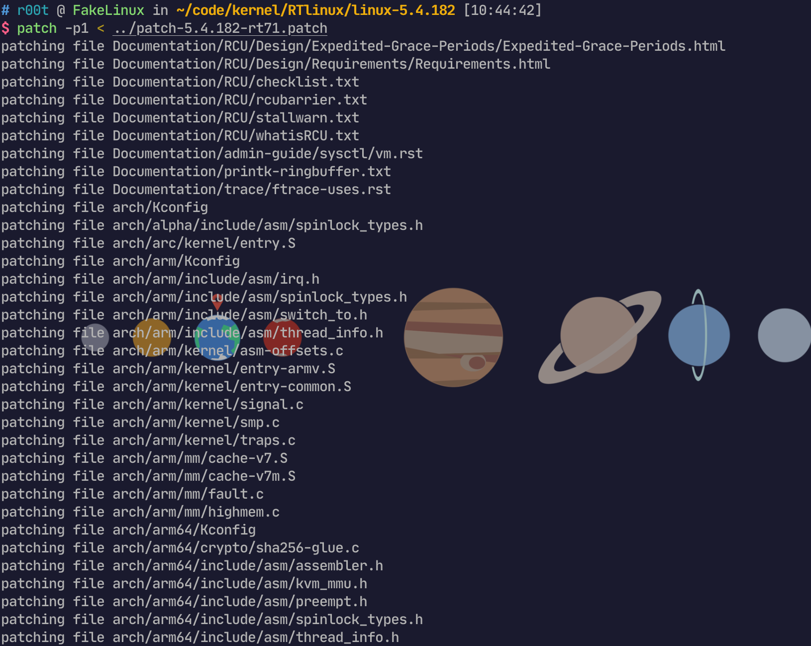
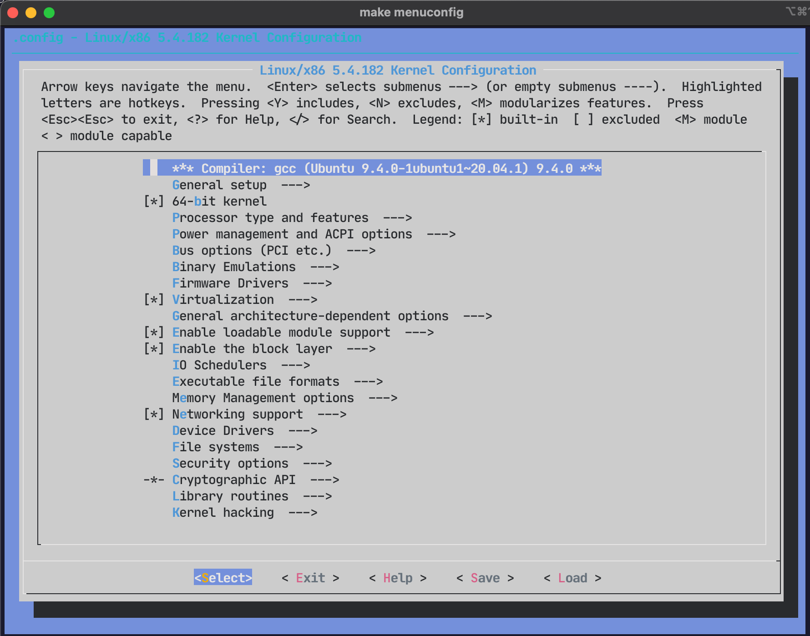
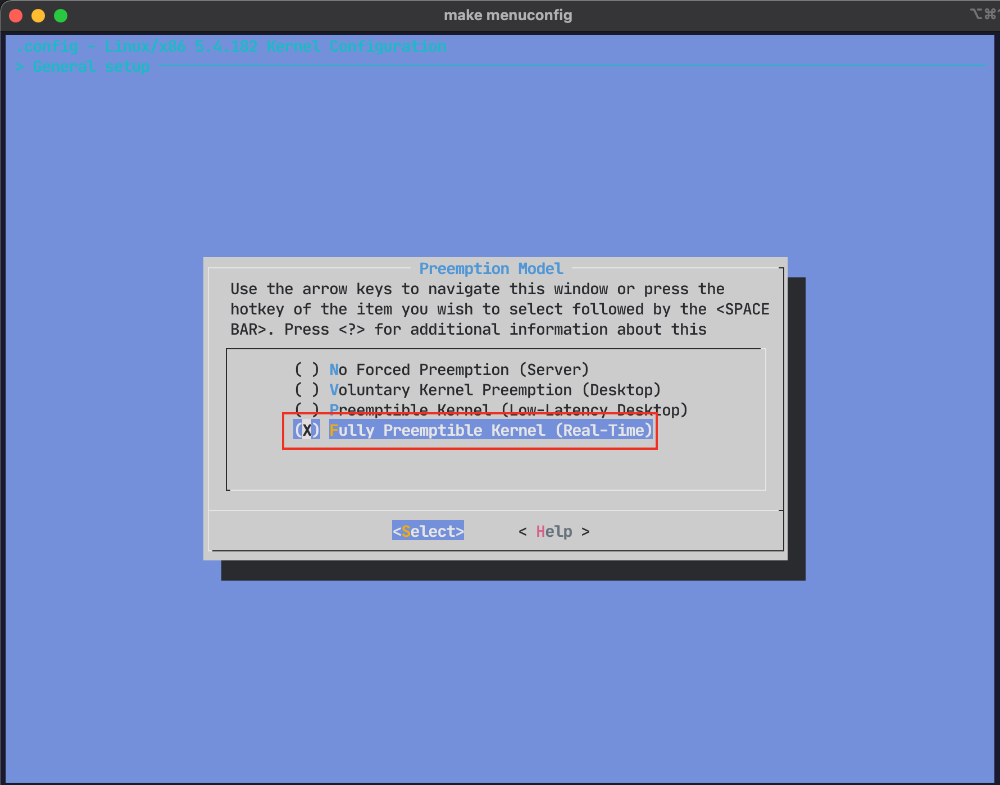
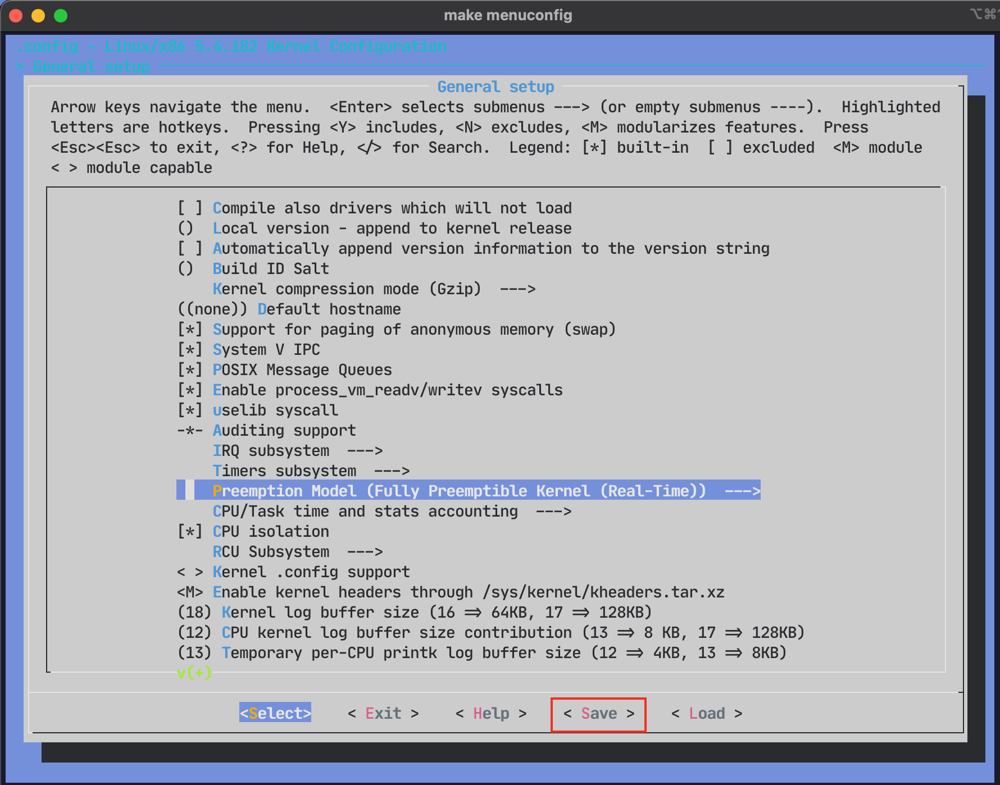
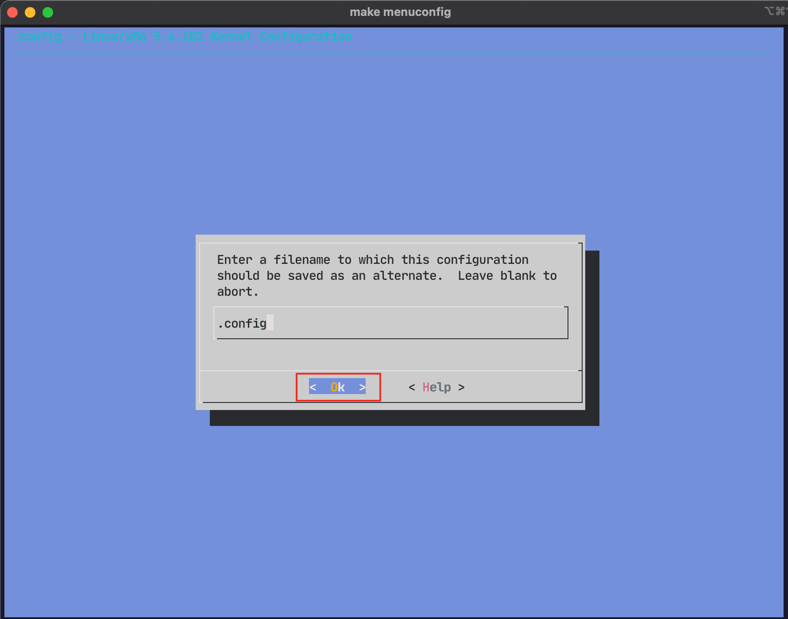
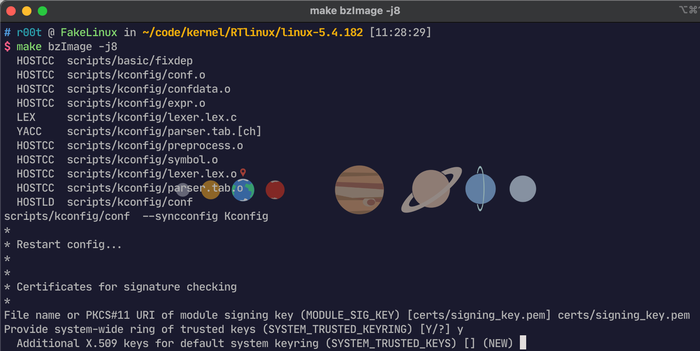
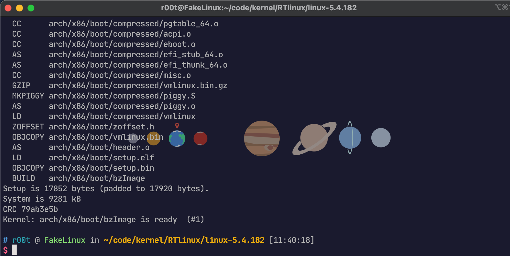
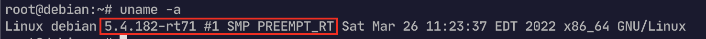
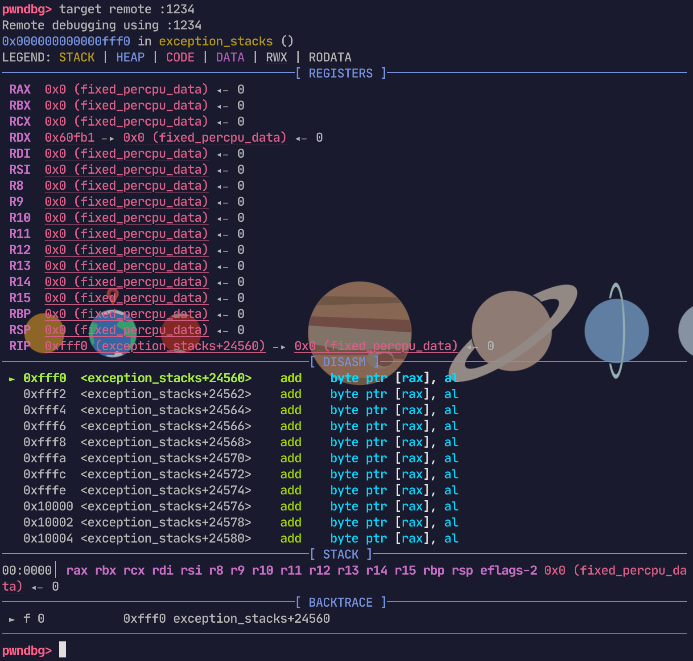
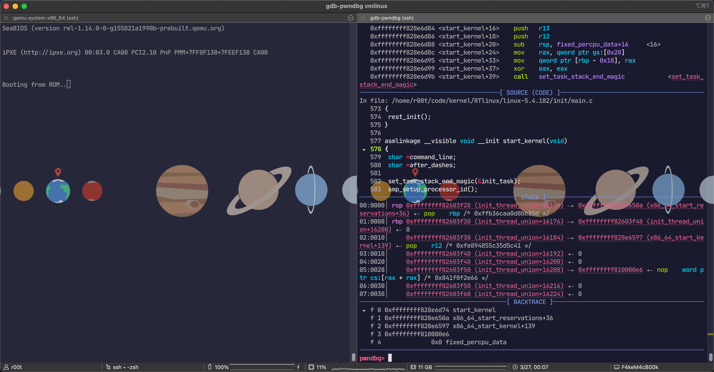

最进工作上遇到了某个设备上用了 [Real-Time Linux](https://rt.wiki.kernel.org/index.php/Main_Page) ，刚开始没注意到 uname -a 中的 banner，以为只是普通的 Linux，但是转念一想 Linux 也不是实时操作系统啊，仔细一看发现 PREEMPT RT

```
4.1.5-rt5-xxxxx (xx@xxxxxxx) #0 SMP PREEMPT RT Tue Jan 24 00:00:00 JST 2017
```

查了一下才知道是通过对内核打补丁来实现 ”实时“，我就找到了这个 wiki：https://rt.wiki.kernel.org/index.php/Main_Page

然后我就尝试自己打补丁编译内核，方便后期的研究，也就此记录一下编译步骤

## 准备工作


### 下载补丁

根据官方 wiki 的指引首先在 https://mirrors.edge.kernel.org/pub/linux/kernel/projects/rt/ 中找到自己需要的版本，我选的是 `linux-5.4.182` ，对应的 patch 文件应该是 `patch-5.4.182-rt71.patch`

```bash
wget https://mirrors.edge.kernel.org/pub/linux/kernel/projects/rt/5.4/patch-5.4.182-rt71.patch.gz
```

得到 `patch-5.4.182-rt71.patch.gz` 文件


### 下载内核源码

然后下载对应的内核源码 `linux-5.4.182.tar.xz`，源码可以在 https://mirrors.edge.kernel.org/pub/linux/kernel 下载，也可以在`kernel.org` 下载，亦或者是其他镜像站，反正版本和补丁对得上就行

```bash
wget https://mirrors.edge.kernel.org/pub/linux/kernel/v5.x/linux-5.4.182.tar.xz
```


### 给内核源码打补丁

首先先解压下载的内核源码和 patch 文件

```bash
tar -xvf linux-5.4.182.tar.xz
gzip -d patch-5.4.182-rt71.patch.gz
```

得到文件夹 `linux-5.4.182` 和文件 `patch-5.4.182-rt71.patch`

 进入内核源码文件夹，并使用 `patch` 工具进行打补丁

```
cd linux-5.4.182
patch -p1 < ../patch-5.4.182-rt71.patch
```



### 配置编译参数

编译打开基于 [ncurses](https://en.wikipedia.org/wiki/Ncurses) 的图形配置界面

```bash
make menuconfig
```

进入如下的页面



我们需要打开 `PREEMPT_RT` 编译选项，这个选项位于 

```General setup  ---> Preemption Model (Voluntary Kernel Preemption (Desktop))```

选择 `Fully Preemptible Kernel (Real-Time)`



然后根据自己的需求再配置其他编译选项，比如开启 kdbg 啥的，然后选择 `save` 生成 `.config` 即可






### 开始编译

我开启 8 个线程编译，所以 `-j8` ，自己根据自己的需求改动

我需要生成 `bzImage`，所以

```
make bzImage -j8
```

关于报错

```
make[1]: *** No rule to make target 'debian/canonical-certs.pem', needed by 'certs/x509_certificate_list'.  Stop.
```

可以通过执行，暂时解决，这个 key ring 的作用请参见：https://www.kernelconfig.io/config_system_trusted_keyring

```
scripts/config --disable SYSTEM_TRUSTED_KEYS
```



直接回车即可

编译成功




### qemu 调试测试

搞一个装有系统的 `qcow2` 镜像（好像 `debian` 官网就有现成的）和 `initrd`

```bash
qemu-system-x86_64 -m 2G -drive file=image.qcow2 -device e1000,netdev=net -netdev user,id=net,hostfwd=tcp::2222-:22 -kernel vmlinux -initrd initrd -nographic -s -S -append "root=LABEL=rootfs console=ttyS0"
```




gdb 远程调试



在 内核入口函数下断点`hb start_kernel`



成功断下，开始愉快的 Real-Time Linux hack 之旅吧
